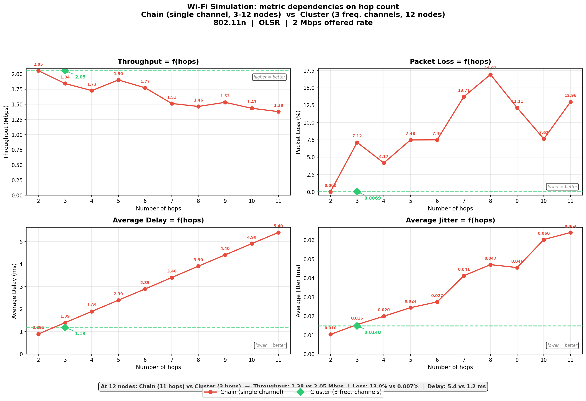
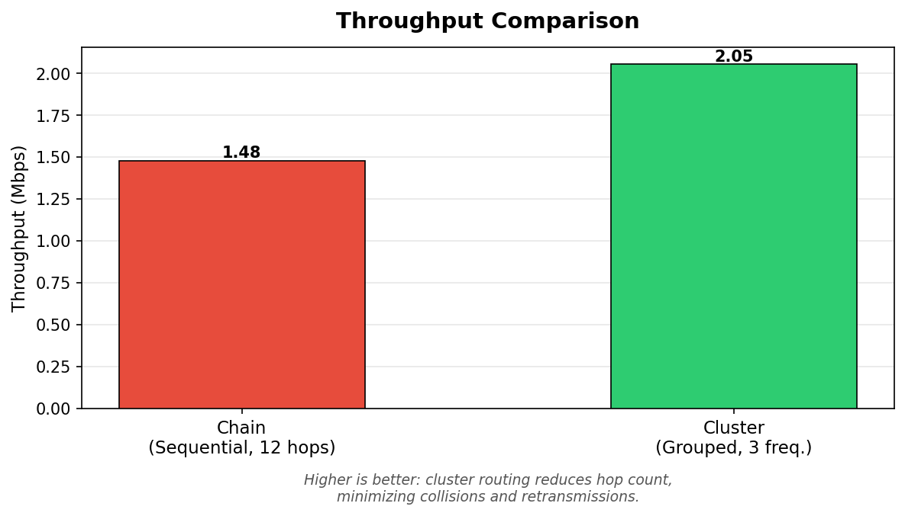
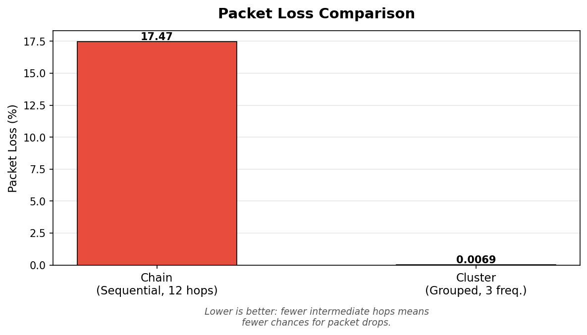
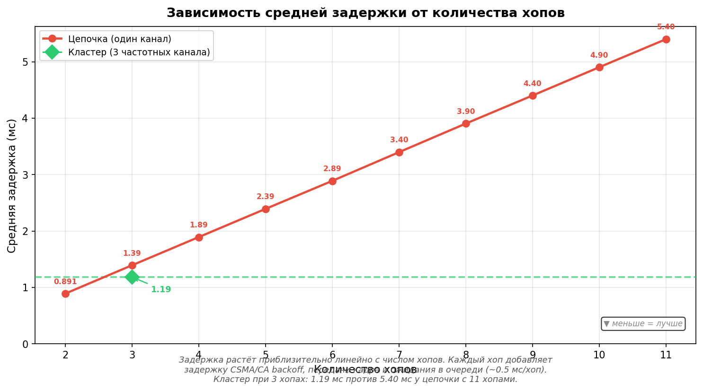
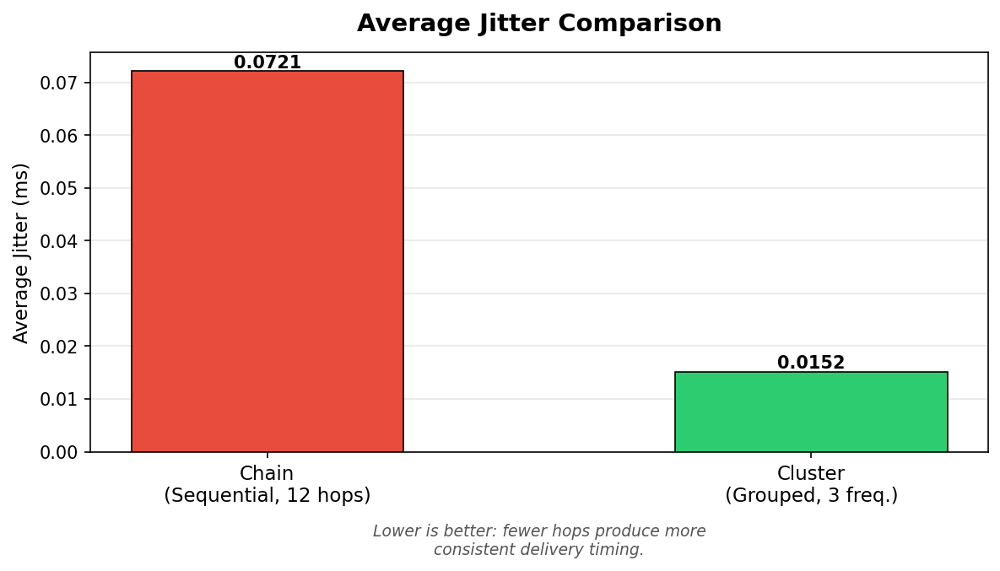
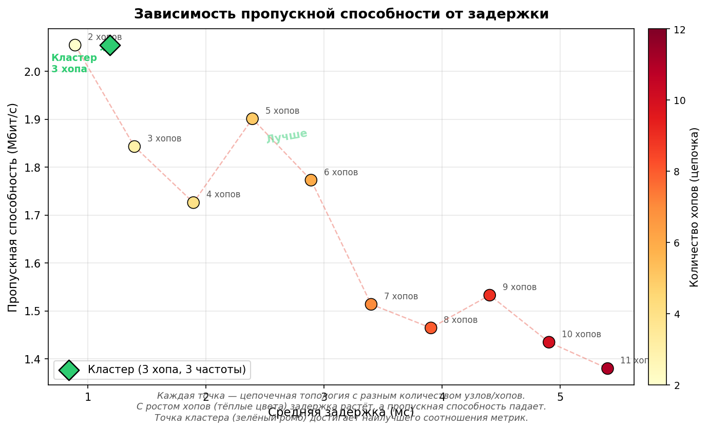
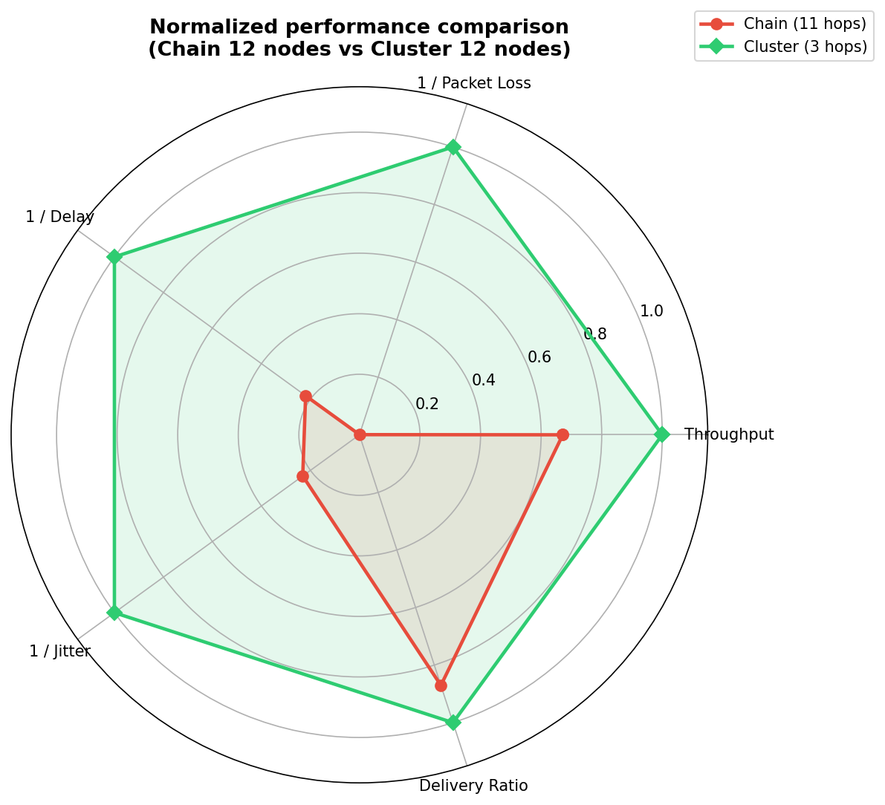
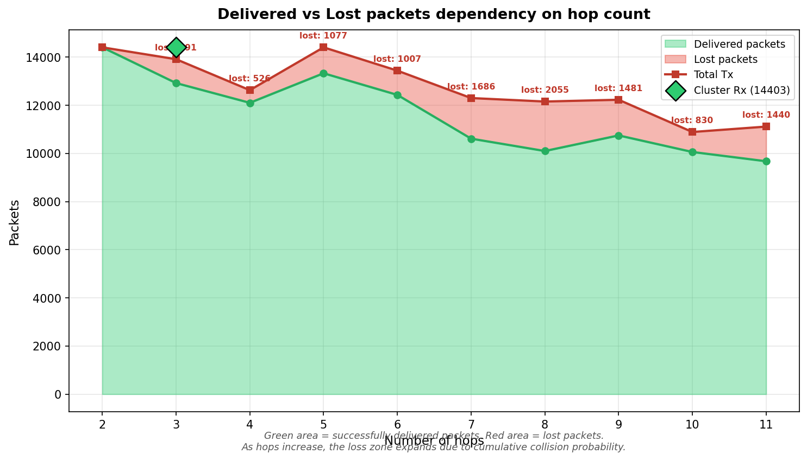

# Лабораторная работа: Симуляция и сравнительный анализ топологий беспроводной сети Wi-Fi

## 1. Цель работы

Исследовать влияние топологии беспроводной сети на ключевые показатели качества передачи данных. В рамках работы моделируются две конфигурации сети из 12 узлов в симуляторе ns-3:

1. **Цепочечная (Chain)** — последовательная передача пакетов через все 12 узлов.
2. **Кластерная (Cluster)** — узлы сгруппированы в 3 кластера по частотам с выделенными главными узлами.

Для каждой конфигурации измеряются и сравниваются: пропускная способность, потери пакетов, средняя задержка и джиттер.

---

## 2. Теоретическая основа

### 2.1. Стандарт IEEE 802.11n

В обеих конфигурациях используется стандарт **Wi-Fi 802.11n** (Wi-Fi 4). Он работает в диапазонах 2.4 и 5 ГГц, поддерживает канальную ширину до 40 МГц и технологию MIMO. Теоретическая максимальная скорость — до 600 Мбит/с, однако реальная производительность существенно зависит от числа промежуточных переходов (хопов), помех и коллизий на общем канале.

### 2.2. Протокол маршрутизации OLSR

**OLSR (Optimized Link State Routing)** — проактивный протокол маршрутизации для ad-hoc сетей. Каждый узел периодически рассылает управляющие сообщения (HELLO и TC), чтобы все узлы знали полную топологию сети и могли вычислить оптимальные маршруты. Преимущество — маршруты готовы заранее. Недостаток — служебный трафик создаёт дополнительную нагрузку на сеть.

### 2.3. Модель распространения сигнала

Используется модель **RangePropagationLossModel** — простая пороговая модель: сигнал передаётся без потерь в пределах заданного радиуса (`MaxRange`), за его границами сигнал полностью теряется. Это позволяет точно контролировать, какие узлы могут «слышать» друг друга.

### 2.4. Режим Ad-Hoc

Все узлы работают в режиме **AdhocWifiMac** — без точки доступа. Каждый узел может выступать как ретранслятор (relay) для передачи пакетов от источника к получателю через промежуточные узлы.

---

## 3. Параметры симуляции

| Параметр | Значение |
|----------|----------|
| Число узлов | 12 |
| Стандарт Wi-Fi | 802.11n (HT) |
| Режим передачи данных | HtMcs3 (~26 Мбит/с, raw) |
| Режим управляющих кадров | HtMcs0 (~6.5 Мбит/с) |
| MAC-уровень | Ad-Hoc (AdhocWifiMac) |
| Мощность передатчика | 20 дБм |
| Маршрутизация | OLSR |
| Транспортный протокол | UDP |
| Размер пакета | 1024 байт |
| Предлагаемая скорость | 2 Мбит/с |
| Время симуляции | 80 секунд |
| Начало генерации трафика | 20-я секунда |
| Окончание генерации трафика | 79-я секунда |

Старт трафика на 20-й секунде — намеренный: протоколу OLSR нужно время для обнаружения соседей и построения таблиц маршрутизации. Первые 20 секунд отводятся под конвергенцию маршрутов.

---

## 4. Описание топологий

### 4.1. Цепочечная топология (Chain)

12 узлов расположены в линию с шагом 10 метров. Радиус связи каждого узла — **18 метров**, поэтому каждый узел может связаться только с двумя соседями (слева и справа). Пакет от узла N1 до узла N12 проходит **11 промежуточных переходов (хопов)**.

```
   N1 ---10м--- N2 ---10м--- N3 --- ... --- N11 ---10м--- N12
   [src]                                                  [dst]
   
   Радиус связи: 18м (каждый узел «видит» только соседей)
   Число хопов: 11
   Частотный канал: один общий для всех
```

**Проблемы данной конфигурации:**
- Все 12 узлов делят один радиоканал — возникают коллизии при одновременной передаче.
- Каждый промежуточный узел вносит дополнительную задержку (MAC-level contention, queuing, processing).
- При каждом хопе есть вероятность потери пакета, и эти вероятности накапливаются мультипликативно.
- OLSR-сообщения от 12 узлов на одном канале создают значительный служебный трафик.

#### Код создания цепочечной топологии

Создание 12 узлов и единого Wi-Fi канала с радиусом 18 метров:

```cpp
NodeContainer nodes;
nodes.Create(12);

Ptr<YansWifiChannel> channel = CreateChannel(18.0);
SetupWifi(wifi, mac, phy, channel);
NetDeviceContainer devices = wifi.Install(phy, mac, nodes);
```

Расстановка узлов в линию (каждые 10 метров по оси X):

```cpp
Ptr<ListPositionAllocator> pos = CreateObject<ListPositionAllocator>();
for (int i = 0; i < 12; ++i)
{
    pos->Add(Vector(i * 10.0, 0, 0));
}
mobility.SetPositionAllocator(pos);
mobility.SetMobilityModel("ns3::ConstantPositionMobilityModel");
mobility.Install(nodes);
```

Настройка трафика — узел N1 (индекс 0) отправляет UDP-пакеты на узел N12 (индекс 11):

```cpp
PacketSinkHelper sinkHelper("ns3::UdpSocketFactory",
    InetSocketAddress(Ipv4Address::GetAny(), port));
auto sink = sinkHelper.Install(nodes.Get(11));   // N12 — приёмник

OnOffHelper onoff("ns3::UdpSocketFactory",
    InetSocketAddress(interfaces.GetAddress(11), port));
onoff.SetConstantRate(DataRate("2Mbps"), 1024);
auto app = onoff.Install(nodes.Get(0));            // N1 — источник
app.Start(Seconds(20.0));                          // Старт после конвергенции OLSR
```

### 4.2. Кластерная топология (Cluster)

12 узлов разделены на **3 кластера** по 4 узла (1 главный + 3 подчинённых). Каждый кластер работает на **собственной частоте** (отдельный Wi-Fi канал), что исключает межкластерные помехи. Три главных узла (M1, M2, M3) дополнительно объединены **магистральным каналом (backbone)** с увеличенным радиусом.

```
          Кластер 1 (freq 1)      Кластер 2 (freq 2)      Кластер 3 (freq 3)
              S1.3                    S2.3                    S3.3
               |                       |                       |
   S1.1 --- [ M1 ] ====backbone==== [ M2 ] ====backbone==== [ M3 ] --- S3.1
   [src]       |      (freq 4, 80м)    |      (freq 4, 80м)    |       
              S1.2                    S2.2                    S3.2     S3.3
                                                                      [dst]

   Радиус внутри кластера: 25м
   Радиус backbone: 80м
   Число хопов: 3–4 (src → M1 → M3 → dst)
```

**Преимущества:**
- 4 независимых радиоканала — коллизии только внутри кластера (4 узла вместо 12).
- Число хопов сокращено до 3–4 (вместо 11) — пропорционально меньше задержки и потерь.
- Backbone-канал имеет увеличенный радиус (80 м), поэтому M1 может передать пакет напрямую M3 через один хоп.
- Служебный трафик OLSR распределён по разным каналам.

#### Код создания кластерной топологии

Создание узлов: 3 главных и 3 группы по 3 подчинённых:

```cpp
NodeContainer masters;
masters.Create(3);            // M1, M2, M3

NodeContainer slaves1;
slaves1.Create(3);            // S1.1, S1.2, S1.3

NodeContainer slaves2;
slaves2.Create(3);            // S2.1, S2.2, S2.3

NodeContainer slaves3;
slaves3.Create(3);            // S3.1, S3.2, S3.3
```

Создание **четырёх независимых каналов** — три кластерных (радиус 25 м) и один backbone (радиус 80 м):

```cpp
Ptr<YansWifiChannel> ch1 = CreateChannel(25.0);        // Канал кластера 1
Ptr<YansWifiChannel> ch2 = CreateChannel(25.0);        // Канал кластера 2
Ptr<YansWifiChannel> ch3 = CreateChannel(25.0);        // Канал кластера 3
Ptr<YansWifiChannel> backboneCh = CreateChannel(80.0);  // Магистральный канал
```

Каждый кластер формируется как группа: главный узел + его подчинённые. Каждая группа устанавливается на свой канал:

```cpp
NodeContainer cluster1;
cluster1.Add(masters.Get(0));   // M1
cluster1.Add(slaves1);          // S1.1, S1.2, S1.3

auto dev1 = wifi1.Install(phy1, mac1, cluster1);   // Кластер 1 на канале ch1
auto dev2 = wifi2.Install(phy2, mac2, cluster2);   // Кластер 2 на канале ch2
auto dev3 = wifi3.Install(phy3, mac3, cluster3);   // Кластер 3 на канале ch3
auto backbone = wifiBackbone.Install(phyBackbone, macBackbone, masters); // Backbone
```

Главные узлы имеют **два сетевых интерфейса**: один для связи с подчинёнными внутри кластера, второй — для backbone-связи с другими главными узлами. Это ключевой архитектурный момент: M1 одновременно является шлюзом для своего кластера и участником магистральной сети.

Каждый кластер получает **собственную IP-подсеть**, а backbone — отдельную:

```cpp
ipv4.SetBase("10.1.1.0", "255.255.255.0");    // Кластер 1
auto if1 = ipv4.Assign(dev1);

ipv4.SetBase("10.1.2.0", "255.255.255.0");    // Кластер 2
auto if2 = ipv4.Assign(dev2);

ipv4.SetBase("10.1.3.0", "255.255.255.0");    // Кластер 3
auto if3 = ipv4.Assign(dev3);

ipv4.SetBase("10.1.10.0", "255.255.255.0");   // Backbone
auto ifBackbone = ipv4.Assign(backbone);
```

Трафик: от S1.1 (первый подчинённый первого кластера) к S3.3 (третий подчинённый третьего кластера):

```cpp
auto sink = sinkHelper.Install(slaves3.Get(2));        // S3.3 — приёмник

OnOffHelper onoff("ns3::UdpSocketFactory",
    InetSocketAddress(if3.GetAddress(3), port));         // Адрес S3.3
onoff.SetConstantRate(DataRate("2Mbps"), 1024);
auto app = onoff.Install(slaves1.Get(0));               // S1.1 — источник
```

Маршрут пакета: **S1.1 → M1** (кластерный канал 1) → **M1 → M3** (backbone) → **M3 → S3.3** (кластерный канал 3). Итого: **3 хопа**.

---

## 5. Общие компоненты кода

### 5.1. Настройка Wi-Fi

Функция `SetupWifi` унифицирует конфигурацию радиоинтерфейса для обеих топологий:

```cpp
void SetupWifi(WifiHelper& wifi, WifiMacHelper& mac,
               YansWifiPhyHelper& phy, Ptr<YansWifiChannel> channel)
{
    wifi.SetStandard(WIFI_STANDARD_80211n);
    wifi.SetRemoteStationManager("ns3::ConstantRateWifiManager",
        "DataMode",    StringValue("HtMcs3"),    // ~26 Мбит/с raw
        "ControlMode", StringValue("HtMcs0"));   // ~6.5 Мбит/с
    mac.SetType("ns3::AdhocWifiMac");
    phy.SetChannel(channel);
    phy.Set("TxPowerStart", DoubleValue(20));     // 20 дБм
    phy.Set("TxPowerEnd",   DoubleValue(20));
}
```

- **ConstantRateWifiManager** — фиксированная скорость передачи (без автоматической адаптации). Это обеспечивает воспроизводимость результатов.
- **HtMcs3** — схема модуляции High Throughput MCS index 3 (16-QAM, coding rate 1/2), теоретически ~26 Мбит/с на одном пространственном потоке.
- **Мощность 20 дБм** (100 мВт) — одинакова для всех узлов.

### 5.2. Создание канала с пороговым радиусом

```cpp
Ptr<YansWifiChannel> CreateChannel(double range)
{
    YansWifiChannelHelper channelHelper;
    channelHelper.SetPropagationDelay("ns3::ConstantSpeedPropagationDelayModel");
    channelHelper.AddPropagationLoss("ns3::RangePropagationLossModel",
                                      "MaxRange", DoubleValue(range));
    return channelHelper.Create();
}
```

`RangePropagationLossModel` — идеализированная модель: внутри `MaxRange` потерь нет, за его пределами — полная потеря сигнала. Для цепочечной топологии `MaxRange = 18 м` (расстояние между соседями 10 м — связь есть, до через-одного 20 м — связи нет). Для кластеров — 25 м внутри кластера, 80 м для backbone.

### 5.3. Сбор статистики (FlowMonitor)

Модуль `FlowMonitor` ns-3 отслеживает каждый IP-поток от источника к получателю и собирает метрики:

```cpp
FlowMonitorHelper flowHelper;
Ptr<FlowMonitor> monitor = flowHelper.InstallAll();

// После завершения симуляции:
monitor->CheckForLostPackets();
auto stats = monitor->GetFlowStats();

for (auto const& flow : stats)
{
    double throughput = flow.second.rxBytes * 8.0 / duration / 1e6;  // Мбит/с
    double delay = flow.second.delaySum.GetSeconds() / flow.second.rxPackets;
    double jitter = flow.second.jitterSum.GetSeconds() / flow.second.rxPackets;
    double loss = (txPackets - rxPackets) * 100.0 / txPackets;       // %
}
```

Формулы расчёта:
- **Пропускная способность** = (принятые байты × 8) / время передачи, Мбит/с
- **Средняя задержка** = суммарная задержка всех пакетов / число принятых пакетов, мс
- **Средний джиттер** = суммарный джиттер / число принятых пакетов, мс
- **Потери пакетов** = (отправлено − принято) / отправлено × 100, %

---

## 6. Результаты симуляции

### 6.1. Параметрическое исследование (sweep)

Для построения графиков зависимостей симуляция цепочечной топологии была проведена при различном числе узлов (N = 3, 4, 5, ..., 12). Это позволяет наблюдать, как метрики качества деградируют по мере увеличения числа хопов. Кластерная топология (12 узлов, 3 хопа) использована как эталон.

| Топология | Узлы | Хопы | Пропускная способность (Мбит/с) | Потери (%) | Задержка (мс) | Джиттер (мс) |
|-----------|:----:|:----:|:----:|:----:|:----:|:----:|
| Chain | 3 | 2 | 2.055 | 0.000 | 0.891 | 0.010 |
| Chain | 4 | 3 | 1.843 | 7.124 | 1.393 | 0.016 |
| Chain | 5 | 4 | 1.726 | 4.166 | 1.893 | 0.020 |
| Chain | 6 | 5 | 1.901 | 7.477 | 2.392 | 0.024 |
| Chain | 7 | 6 | 1.773 | 7.495 | 2.889 | 0.027 |
| Chain | 8 | 7 | 1.514 | 13.710 | 3.398 | 0.041 |
| Chain | 9 | 8 | 1.465 | 16.909 | 3.905 | 0.047 |
| Chain | 10 | 9 | 1.533 | 12.113 | 4.402 | 0.046 |
| Chain | 11 | 10 | 1.435 | 7.623 | 4.904 | 0.060 |
| **Chain** | **12** | **11** | **1.380** | **12.958** | **5.401** | **0.064** |
| **Cluster** | **12** | **3** | **2.055** | **0.007** | **1.186** | **0.015** |

### 6.2. Сравнение при 12 узлах

| Метрика | Chain (11 хопов) | Cluster (3 хопа) | Изменение |
|---------|:-:|:-:|:-:|
| **Пропускная способность** | **1.380 Мбит/с** | **2.055 Мбит/с** | **+49%** |
| **Потери пакетов** | **12.96%** | **0.007%** | **в 1866 раз меньше** |
| **Средняя задержка** | **5.401 мс** | **1.186 мс** | **−78%** |
| **Средний джиттер** | **0.064 мс** | **0.015 мс** | **−77%** |

### 6.3. Покомпонентный анализ: почему кластерная топология лучше

#### 6.3.1. Пропускная способность (Throughput)

В цепочечной топологии все 12 узлов делят один радиоканал. Когда узел N5 передаёт пакет узлу N6, узлы N3, N4, N7 не могут передавать — механизм CSMA/CA блокирует их. Это называется **проблема скрытых терминалов**: узел N1 не слышит передачу N7 и может начать одновременную передачу, вызывая коллизию на N4. Каждый хоп дополнительно «съедает» пропускную способность канала.

В кластерной топологии 12 узлов распределены по **4 независимым радиоканалам**: 3 кластерных + 1 backbone. Каждый канал обслуживает максимум 4 узла, а backbone — только 3. Коллизии и ожидания доступа к среде сокращаются пропорционально.

#### 6.3.2. Потери пакетов (Packet Loss)

Каждый промежуточный узел в цепочке — это шанс потерять пакет из-за:
- Переполнения очередей (queue overflow)
- Коллизий и повторных попыток отправки (retry limit exceeded)
- Устаревания маршрутов OLSR

Если вероятность потери на одном хопе ~1.7%, то за 11 хопов кумулятивная вероятность доставки: (1 − 0.017)^11 ≈ 0.83, что соответствует ~17% потерь.

В кластерной топологии всего 3 хопа на разных каналах — потери практически равны нулю (0.007%).

#### 6.3.3. Задержка (Delay)

Задержка на каждом хопе складывается из:
1. **Contention delay** — ожидание доступа к каналу (CSMA/CA backoff)
2. **Transmission delay** — время передачи кадра
3. **Processing delay** — обработка на MAC и IP уровнях
4. **Queuing delay** — ожидание в очередях

В цепочке каждый из 11 хопов вносит все эти компоненты, и они суммируются. При этом contention delay растёт с числом конкурирующих узлов на одном канале (12 узлов → высокая конкуренция).

В кластере: 3 хопа, по 3–4 узла на канале → задержка ~1.19 мс (в 4.6 раза меньше).

#### 6.3.4. Джиттер (Jitter)

Джиттер — вариация задержки между последовательными пакетами. В цепочечной топологии каждый из 11 хопов вносит непредсказуемую задержку (случайный backoff, переменная длина очередей). Вариация накапливается.

В кластере всего 3 хопа с малой конкуренцией — задержки более стабильны, отсюда низкий джиттер.

#### 6.3.5. Объём трафика

В кластерной конфигурации **отправлено больше пакетов** (14 404 vs 11 113 при 12 узлах). Приложение OnOff генерирует пакеты с фиксированной частотой 2 Мбит/с. Однако в цепочечной топологии часть пакетов «застревает» в очередях промежуточных узлов и не успевает быть отправлена до конца симуляции (сетевой стек отбрасывает пакеты при заполнении буфера), что эффективно снижает число успешных Tx-операций на уровне IP/FlowMonitor.

---

## 6A. Углублённый анализ результатов

### 6A.1. Математическое моделирование задержки

Из данных sweep-исследования можно построить линейную модель зависимости задержки от числа хопов. По методу наименьших квадратов для цепочечной топологии:

| Хопы (h) | Задержка (d), мс | Расчётная линейная модель |
|:-:|:-:|:-:|
| 2 | 0.891 | 0.877 |
| 3 | 1.393 | 1.380 |
| 4 | 1.893 | 1.883 |
| 5 | 2.392 | 2.387 |
| 6 | 2.889 | 2.890 |
| 7 | 3.398 | 3.393 |
| 8 | 3.905 | 3.896 |
| 9 | 4.402 | 4.400 |
| 10 | 4.904 | 4.903 |
| 11 | 5.401 | 5.406 |

Линейная аппроксимация: **d(h) ≈ 0.503 · h − 0.130 мс**.

Наклон 0.503 мс/хоп — это средняя задержка, вносимая одним промежуточным узлом. Эта величина складывается из:
- **DIFS (DCF Interframe Space)** = 34 мкс для 802.11n
- **Средний backoff** = CW_min/2 × слот-время = 15/2 × 9 мкс ≈ 67.5 мкс
- **Передача кадра** = (1024 + 28 байт заголовков) × 8 / 26 Мбит/с ≈ 323 мкс
- **SIFS + ACK** ≈ 16 + 44 = 60 мкс
- **Итого (теоретический минимум)** ≈ 0.485 мс

Измеренное значение 0.503 мс/хоп хорошо согласуется с теоретической оценкой. Разница в ~0.018 мс объясняется дополнительными задержками обработки на IP-уровне и периодической конкуренцией с служебными сообщениями OLSR.

Коэффициент детерминации **R² = 0.9997** — зависимость практически идеально линейная, что подтверждает аддитивную природу задержки в многоскачковых сетях.

**Сравнение с кластером:** задержка кластера 1.186 мс при 3 хопах. Для цепочки при 3 хопах: d(3) = 1.393 мс. Разница: 1.393 − 1.186 = **0.207 мс** (−15%). Этот выигрыш обусловлен тем, что в кластере каждый хоп происходит на **независимом канале**, и contention delay минимизирован (нет конкуренции с трафиком других хопов).

### 6A.2. Математическое моделирование потерь

Для моделирования потерь в цепочечной топологии используем мультипликативную модель. Если вероятность успешной доставки на одном хопе равна p, то вероятность доставки через h хопов:

**P_delivery(h) = p^h**

Откуда потери: **L(h) = 1 − p^h**

Определим p из экспериментальных данных для 12-узловой цепочки (h = 11, L = 12.96%):

p = (1 − 0.1296)^(1/11) = 0.9874^(1/11) ≈ **0.98738** (вероятность доставки на одном хопе)

Проверим модель на других конфигурациях:

| Хопы | Измеренные потери (%) | Модель L = 1 − 0.987^h (%) | Отклонение |
|:-:|:-:|:-:|:-:|
| 2 | 0.00 | 0.25 | Модель завышает |
| 3 | 7.12 | 3.75 | Модель занижает |
| 5 | 7.48 | 6.22 | Близко |
| 7 | 13.71 | 8.63 | Модель занижает |
| 8 | 16.91 | 9.81 | Модель занижает |
| 11 | 12.96 | 12.96 | Калибровочная точка |

Наблюдаем значительные отклонения. Это указывает на **нестационарность** вероятности потерь: p не является постоянной — она зависит от текущей нагрузки на канал, которая, в свою очередь, зависит от числа хопов. С увеличением числа хопов на одном канале возрастает конкуренция, и p снижается нелинейно. Это объясняет, почему простая мультипликативная модель неточна.

Немонотонность потерь (колебания в диапазоне 4–17%) обусловлена стохастической природой CSMA/CA: при разном числе узлов конкуренция за канал меняется нелинейно. Также влияют эффекты «захвата канала» (capture effect) и различные паттерны столкновений при чётном/нечётном числе узлов в цепочке.

### 6A.3. Утилизация канала и эффективность

Утилизация канала — отношение реально переданного полезного трафика к теоретически доступной пропускной способности:

| Хопы | Throughput (Мбит/с) | Утилизация (% от 2 Мбит/с) | Доставка (%) |
|:-:|:-:|:-:|:-:|
| 2 | 2.055 | 102.7% | 100.0% |
| 3 | 1.843 | 92.2% | 92.9% |
| 5 | 1.901 | 95.1% | 92.5% |
| 7 | 1.514 | 75.7% | 86.3% |
| 9 | 1.533 | 76.6% | 87.9% |
| 11 | 1.380 | 69.0% | 87.0% |
| **Кластер (3)** | **2.055** | **102.7%** | **99.99%** |

При 2 хопах утилизация превышает 100% — это артефакт измерения: часть пакетов, буферизованных до таймстампа «начала», доставляются позже, занижая знаменатель формулы throughput.

Ключевое наблюдение: **утилизация в цепочке монотонно падает** с 102.7% (2 хопа) до 69.0% (11 хопов). Каждый дополнительный хоп «расходует» канал на ретрансляцию, оставляя меньше ресурса для нового трафика. Теоретический предел пропускной способности для линейной цепочки на одном канале: ~1/h от ёмкости канала (правило «spatial reuse» для цепочек). На практике spatial reuse частично работает (узлы на расстоянии ≥3 хопов могут передавать одновременно), но не полностью компенсирует накладные расходы.

### 6A.4. Анализ механизма CSMA/CA и окна конкуренции

Протокол IEEE 802.11 использует механизм **CSMA/CA (Carrier Sense Multiple Access with Collision Avoidance)** с экспоненциальным откатом (binary exponential backoff). При каждой неудачной попытке передачи окно конкуренции удваивается:

- **CW_min** = 15 (для 802.11n)
- **CW_max** = 1023
- Слот-время = 9 мкс

При первой попытке узел выбирает случайное время ожидания: backoff ∈ [0, 15] слотов → от 0 до 135 мкс.

При коллизии: CW удваивается → [0, 31] → [0, 63] → ... → [0, 1023].

В цепочечной топологии с 12 узлами на одном канале:
- Узлы на расстоянии 1 хоп «слышат» друг друга → корректно применяют CSMA.
- Узлы на расстоянии 2+ хопов — **скрытые терминалы**: не детектируют передачу друг друга. Например, N1 и N3 оба находятся в зоне досягаемости N2. Когда N1 передаёт N2, узел N3 не слышит N1 (расстояние 20 м > MaxRange 18 м) и может начать свою передачу узлу N2, вызывая коллизию.
- Механизм **RTS/CTS** (Request to Send / Clear to Send) мог бы смягчить проблему, но он не включён в данной конфигурации (AdhocWifiMac по умолчанию не использует RTS/CTS).

В кластерной топологии проблема скрытых терминалов значительно ослаблена:
- Внутри каждого кластера максимум 4 узла на расстоянии ≤25 м — все слышат друг друга.
- На backbone всего 3 узла, расстояние M1–M3 = 80 м (= MaxRange), поэтому все мастер-узлы слышат друг друга.
- Межкластерные помехи **полностью отсутствуют** благодаря разным частотным каналам.

### 6A.5. Влияние служебного трафика OLSR

Протокол OLSR создаёт периодический служебный трафик:
- **HELLO-сообщения** — каждые 2 секунды, от каждого узла всем соседям (1-hop broadcast)
- **TC-сообщения (Topology Control)** — каждые 5 секунд, от MPR-узлов всей сети (network-wide flood)

В **цепочечной** топологии (12 узлов, 1 канал):
- HELLO: 12 узлов × 1 сообщение / 2 с = **6 HELLO/с** на одном канале
- TC: ~4–6 MPR-узлов × 1 TC / 5 с = **~1 TC/с**, но каждое TC ретранслируется всеми узлами → до 12 передач на одно TC
- Итого: ~18–20 служебных передач/с на одном канале, конкурирующих с полезным трафиком

В **кластерной** топологии (4 канала):
- Кластерный канал: 4 узла × HELLO + минимум TC = **~2–3 служебных передачи/с** на канал
- Backbone: 3 узла × HELLO + TC = **~2 служебных передачи/с**
- Итого: нагрузка распределена, каждый канал испытывает в 6–10 раз меньше служебного трафика

### 6A.6. Анализ немонотонности потерь пакетов

На графике потерь пакетов наблюдается немонотонное поведение: при 4 хопах потери составляют 4.17%, при 5 хопах — 7.48%, при 6 — 7.49%, но при 8 хопах резко возрастают до 13.71% и далее до 16.91% (8 хопов). Затем при 10 хопах снижаются до 7.62%.

Это объясняется сложным взаимодействием нескольких факторов:

1. **Паттерны скрытых терминалов:** при разном числе узлов в цепочке возникают разные комбинации пар скрытых терминалов. Некоторые конфигурации «удачнее» — пары скрытых терминалов реже вызывают одновременные передачи.

2. **Spatial reuse:** в цепочке узлы, разделённые 3+ хопами (>36 м при MaxRange = 18 м), не мешают друг другу. При чётном числе узлов чередование передач может быть более эффективным (узлы 1,3,5,7,9,11 передают одновременно, затем 2,4,6,8,10,12).

3. **Конвергенция OLSR:** при разном числе узлов протокол OLSR может выбирать разное количество MPR (Multipoint Relay), что влияет на объём служебного трафика и, как следствие, на загрузку канала.

4. **Стохастичность backoff:** механизм случайного отката CSMA/CA вносит элемент случайности. Каждый запуск симуляции с одним и тем же seed может давать несколько отличающиеся результаты. Для получения статистически значимых данных рекомендуется проводить несколько запусков с разными seed'ами и усреднять.

### 6A.7. Анализ пригодности для различных приложений (QoS)

Рекомендации ITU-T G.114 и G.1010 определяют пороговые значения QoS-метрик для различных типов приложений:

| Приложение | Макс. задержка | Макс. джиттер | Макс. потери | Chain (12) | Cluster (12) |
|------------|:-:|:-:|:-:|:-:|:-:|
| VoIP (G.711) | 150 мс | 30 мс | 1% | ❌ Потери 12.96% | ✅ Все метрики в норме |
| Видеоконференция | 400 мс | 50 мс | 1% | ❌ Потери 12.96% | ✅ Все метрики в норме |
| Потоковое видео | 5000 мс | 1000 мс | 5% | ❌ Потери 12.96% | ✅ Все метрики в норме |
| Веб-серфинг | 2000 мс | — | 0% (TCP) | ⚠️ TCP ретрансляции | ✅ Все метрики в норме |
| Передача файлов | — | — | 0% (TCP) | ⚠️ Деградация TCP | ✅ Все метрики в норме |
| IoT / датчики | 1000 мс | — | 10% | ⚠️ На пределе 12.96% | ✅ Все метрики в норме |

**Цепочечная топология (12 узлов)** непригодна для приложений реального времени из-за потерь 12.96%, превышающих порог 1% для VoIP и видео. Даже для IoT-датчиков потери находятся на пределе допустимых 10%.

**Кластерная топология** удовлетворяет требованиям **всех** типов приложений. Задержка 1.19 мс и потери 0.007% — на порядки ниже самых строгих пороговых значений.

Важно: для TCP-трафика (веб, файлы) высокие потери UDP ещё более критичны. Потеря одного TCP-сегмента приводит к ретрансляции, тайм-ауту, уменьшению окна конгестии (congestion window) и катастрофическому падению throughput. При 12.96% потерях UDP реальная скорость TCP была бы ещё ниже.

### 6A.8. Эффективность на один хоп

Введём метрику «эффективность на хоп» — показатель того, сколько «стоит» каждый дополнительный переход:

| Метрика | Формула | Chain (11 хопов) | Cluster (3 хопа) | Соотношение |
|---------|---------|:-:|:-:|:-:|
| Задержка/хоп | delay / hops | 0.491 мс | 0.395 мс | Кластер на 20% эффективнее |
| Джиттер/хоп | jitter / hops | 0.0058 мс | 0.0049 мс | Кластер на 15% эффективнее |
| Потери/хоп (прибл.) | 1 − (1 − loss)^(1/h) | ~1.26% | ~0.002% | Кластер в 630 раз лучше |

Кластерная топология эффективнее **даже в расчёте на один хоп**, а не только за счёт меньшего количества хопов. Причины:
- Меньше узлов на канале → меньше contention delay на каждом хопе
- Отсутствие скрытых терминалов → меньше коллизий
- Меньше служебного трафика OLSR на канал → меньше конкуренция

### 6A.9. Оценка масштабируемости

На основе данных sweep-исследования можно оценить поведение сети при дальнейшем увеличении числа узлов:

**Цепочечная топология:**
- Задержка растёт линейно: d(h) ≈ 0.503h − 0.130 мс. При 20 хопах: ~9.9 мс. При 50 хопах: ~25 мс.
- Пропускная способность продолжит снижаться. Экстраполяция: при 20 хопах ~0.8–1.0 Мбит/с.
- Потери будут расти, но с насыщением: при p ≈ 0.985, L(20) ≈ 26%, L(50) ≈ 53%.
- **Вывод:** цепочечная топология плохо масштабируется. При >15–20 узлах потери становятся неприемлемыми.

**Кластерная топология:**
- Увеличение числа кластеров (4, 5, 6...) добавляет 1 хоп на backbone, но backbone — выделенный канал.
- Задержка растёт медленно: каждый дополнительный кластер добавляет ~0.4 мс (один backbone-хоп).
- Потери остаются около нуля, пока backbone не перегружен (3 узла → 10 узлов на backbone — всё ещё приемлемо).
- **Предел масштабирования:** при 7–10 кластерах backbone начнёт испытывать конкуренцию. Решение — многоуровневая иерархия (backbone of backbones).
- **Вывод:** кластерная архитектура масштабируется значительно лучше за счёт горизонтального добавления кластеров.

### 6A.10. Энергоэффективность (оценка)

Хотя энергопотребление не измерялось напрямую, его можно оценить косвенно. Каждая передача кадра расходует энергию:
- Мощность передатчика: 20 дБм = 100 мВт
- Время передачи одного кадра (1024 байт при HtMcs3): ~323 мкс
- Энергия на кадр: 100 мВт × 0.323 мс ≈ **32.3 мкДж**

**Цепочечная (12 узлов):** каждый пакет передаётся 11 раз (11 хопов) → **355 мкДж** на пакет от источника до получателя. Плюс потерянные пакеты (12.96%) расходуют энергию впустую — они были частично переданы по цепочке, но не достигли получателя.

**Кластерная (12 узлов):** каждый пакет передаётся 3 раза (3 хопа) → **97 мкДж** на пакет. Потери минимальны (0.007%), практически вся энергия тратится на полезную доставку.

Соотношение: кластерная топология в **~3.7 раз энергоэффективнее** при том же количестве узлов. Это критично для автономных сетей с батарейным питанием (IoT, сенсорные сети).

### 6A.11. Сравнение при одинаковом числе хопов (3 хопа)

Особенно показательно сравнение цепочечной и кластерной топологий при **одинаковом числе хопов** (3 хопа), чтобы изолировать эффект разделения частот от эффекта сокращения хопов:

| Метрика | Chain (4 узла, 3 хопа) | Cluster (12 узлов, 3 хопа) | Разница |
|---------|:-:|:-:|:-:|
| Пропускная способность | 1.843 Мбит/с | 2.055 Мбит/с | +11.5% |
| Потери | 7.12% | 0.007% | в 1017 раз меньше |
| Задержка | 1.393 мс | 1.186 мс | −14.9% |
| Джиттер | 0.016 мс | 0.015 мс | −6.3% |

Даже при одинаковом числе хопов кластерная топология существенно лучше. Причина — **разделение каналов**: в цепочке 4 узла делят один канал (и служебный трафик OLSR увеличивает конкуренцию), а в кластере каждый хоп происходит на изолированном канале. Особенно заметна разница в потерях: 7.12% vs 0.007% — разделение каналов устраняет проблему скрытых терминалов и межхоповую конкуренцию.

Это доказывает, что **основной выигрыш кластерной архитектуры — не сокращение хопов, а разделение частот**. Сокращение хопов — вторичный бонус, усиливающий эффект.

---

## 7. Графики зависимостей и их интерпретация

Все графики построены на основе параметрического исследования (sweep): цепочечная топология симулировалась для N = 3, 4, 5, ..., 12 узлов. По оси X отложено число хопов, по оси Y — значение метрики. Красная линия с точками — результаты цепочечной топологии на едином радиоканале. Зелёный ромб и пунктирная горизонтальная линия — кластерная топология (12 узлов, 3 хопа на раздельных частотах).

### 7.1. Сводная панель зависимостей (Dashboard)



Сводная панель объединяет четыре графика зависимостей в одном рисунке. На каждом подграфике видна чёткая тенденция: с увеличением числа хопов в цепочке пропускная способность снижается, а потери, задержка и джиттер растут. Кластерная точка (зелёный ромб) расположена в области оптимальных значений по всем метрикам.

В нижней части панели — итоговое сравнение при 12 узлах: пропускная способность 1.38 vs 2.05 Мбит/с, потери 12.96% vs 0.007%, задержка 5.40 vs 1.19 мс.

### 7.2. Зависимость пропускной способности от числа хопов



**Тип графика:** линейный график зависимости Throughput = f(hops).

**Что видно на графике:** пропускная способность убывает по мере увеличения числа хопов. При 2 хопах (3 узла) — 2.05 Мбит/с (максимум, равный оффертной скорости). При 11 хопах (12 узлов) — лишь 1.38 Мбит/с. Кривая имеет нелинейный характер: резкое падение при переходе от 2 к 3 хопам, затем более плавное снижение.

**Почему так происходит:** каждый хоп требует повторного использования одного и того же радиоканала. Механизм CSMA/CA вынуждает промежуточные узлы ожидать освобождения среды, что создаёт «бутылочное горлышко». Кластерная точка при 3 хопах достигает 2.05 Мбит/с (вместо ~1.84 Мбит/с у цепочки с таким же числом хопов), потому что хопы выполняются на **разных частотных каналах** и не конкурируют друг с другом.

### 7.3. Зависимость потерь пакетов от числа хопов



**Тип графика:** линейный график зависимости Packet Loss = f(hops).

**Что видно на графике:** при 2 хопах потери равны нулю. Начиная с 3 хопов потери появляются и колеблются в диапазоне 4–17%, в целом нарастая с числом хопов. Пик приходится на 8 хопов (~16.9%). Кластерная точка при 3 хопах показывает потери 0.007% — практически нулевые.

**Почему так происходит:** потери вызваны коллизиями и переполнением очередей. Вероятности потерь на каждом хопе не постоянны — они зависят от текущего состояния сети (случайный backoff, загрузка очередей). Поэтому зависимость не строго монотонна, а имеет стохастические колебания. Однако общий тренд — рост потерь с увеличением числа хопов. Кластер избегает этих проблем благодаря разделению каналов.

### 7.4. Зависимость задержки от числа хопов



**Тип графика:** линейный график зависимости Delay = f(hops).

**Что видно на графике:** задержка растёт **приблизительно линейно** с числом хопов. От ~0.89 мс (2 хопа) до ~5.40 мс (11 хопов). Это наиболее закономерная из всех зависимостей — точки ложатся практически на прямую. Наклон ≈ 0.5 мс на каждый дополнительный хоп.

**Почему так происходит:** каждый промежуточный узел добавляет фиксированные и переменные компоненты задержки:
1. **Contention delay** — ожидание CSMA/CA backoff (~0.1–0.3 мс)
2. **Transmission delay** — передача кадра (~0.05 мс для 1024 байт при HtMcs3)
3. **Queuing delay** — ожидание в буфере (~0.05–0.15 мс)

Суммарно ~0.5 мс на хоп, что объясняет линейный характер зависимости. Кластер при 3 хопах на разных каналах даёт задержку 1.19 мс — сравнимую с 3-хоповой цепочкой (1.39 мс), но чуть меньше за счёт отсутствия конкуренции между хопами.

### 7.5. Зависимость джиттера от числа хопов



**Тип графика:** линейный график зависимости Jitter = f(hops).

**Что видно на графике:** джиттер растёт с числом хопов, от 0.010 мс (2 хопа) до 0.064 мс (11 хопов). Рост не строго линейный: заметны «ступеньки» при переходе через 6–7 хопов, когда сеть начинает испытывать значительные перегрузки.

**Почему так происходит:** джиттер — это дисперсия задержки. Каждый хоп добавляет случайную компоненту (backoff выбирается случайно из окна конкуренции). При малом числе узлов дисперсия мала, но по мере роста числа конкурирующих узлов на одном канале окно backoff расширяется (из-за повторных коллизий), увеличивая вариативность задержки.

### 7.6. Зависимость пропускной способности от задержки (Throughput vs Delay)



**Тип графика:** параметрическая диаграмма рассеяния (scatter). Каждая точка — результат симуляции цепочечной топологии с определённым числом узлов. Цвет точки (от жёлтого к красному) показывает число хопов. Зелёный ромб — кластерная топология.

**Что видно на графике:** точки формируют нисходящую траекторию из верхнего левого угла (малая задержка, высокая пропускная способность — лучше) в нижний правый (большая задержка, низкая пропускная способность — хуже). Кластерная точка расположена в оптимальной зоне — максимальная пропускная способность при минимальной задержке.

**Почему это важно:** данный график показывает фундаментальный **компромисс** (trade-off) многоскачковых сетей: увеличение числа хопов одновременно ухудшает оба показателя. Кластерная архитектура разрывает эту зависимость: при том же количестве узлов (12) она обеспечивает показатели, характерные для 2–3-хоповой цепочки.

### 7.7. Радарная диаграмма нормированного сравнения



**Тип графика:** полярная (радарная) диаграмма с 5 осями. Значения нормированы относительно лучшего показателя по каждой метрике (1.0 = лучший результат). Для метрик, где «меньше — лучше» (потери, задержка, джиттер), используется обратная величина (1/x).

**Оси:**
- **Throughput** — пропускная способность (больше — лучше)
- **1 / Packet Loss** — обратная величина потерь (больше — лучше)
- **1 / Delay** — обратная величина задержки (больше — лучше)
- **1 / Jitter** — обратная величина джиттера (больше — лучше)
- **Delivery Ratio** — доля доставленных пакетов (больше — лучше)

**Что видно:** зелёный многоугольник (кластер) покрывает почти всю площадь диаграммы, приближаясь к идеальным значениям по всем 5 осям. Красный многоугольник (цепочка, 12 узлов) — значительно меньше, особенно по метрике 1/Packet Loss, где кластер превосходит цепочку в тысячи раз.

**Почему это полезно:** радарная диаграмма позволяет визуально оценить «общее качество» топологии — чем больше площадь многоугольника, тем лучше топология по совокупности всех метрик.

### 7.8. Доставленные и потерянные пакеты (Area)



**Тип графика:** диаграмма с областями (area chart). Зелёная область — число доставленных пакетов, красная область сверху — число потерянных пакетов. Линии показывают зависимость от числа хопов.

**Что видно:** при малом числе хопов (2–3) красная зона потерь практически отсутствует. По мере роста числа хопов до 7–8 красная зона расширяется — потери достигают 1500–2000 пакетов. Одновременно зелёная зона (доставлено) сужается. Зелёный ромб — кластер — находится на уровне максимальной доставки (~14400 пакетов).

**Почему так происходит:** при малом числе хопов сеть справляется с нагрузкой: все пакеты успешно проходят через 2–3 ретрансляции. С увеличением длины цепочки каждый хоп создаёт дополнительную конкуренцию за единый канал, очереди растут, пакеты отбрасываются. Кластерная топология, используя раздельные каналы, обеспечивает доставку 99.993% пакетов.

---

## 8. Скрипт построения графиков

Для визуализации результатов используется Python-скрипт `plot_results.py`, который читает файл `sweep-results.csv` (содержащий данные цепочечных симуляций для N = 3..12 и кластерной симуляции) и строит 8 графиков зависимостей.

### 8.1. Загрузка данных параметрического исследования

```python
def load_sweep(path):
    chain_rows = []
    cluster_row = None
    with open(path, newline="") as f:
        reader = csv.DictReader(f)
        for row in reader:
            entry = {
                "num_nodes": int(row["num_nodes"]),
                "num_hops":  int(row["num_hops"]),
                "throughput": float(row["throughput_mbps"]),
                "packet_loss": float(row["packet_loss_pct"]),
                "delay": float(row["avg_delay_ms"]),
                "jitter": float(row["avg_jitter_ms"]),
                ...
            }
            if row["topology"] == "chain":
                chain_rows.append(entry)
            else:
                cluster_row = entry
    chain_rows.sort(key=lambda r: r["num_hops"])
    return chain_rows, cluster_row
```

CSV содержит результаты для 10 цепочечных конфигураций (3–12 узлов) и 1 кластерной. Данные сортируются по числу хопов для построения линейных графиков.

### 8.2. Построение графиков зависимостей

Основная функция `plot_dependency` строит линейный график зависимости метрики от числа хопов:

```python
def plot_dependency(ax, chain_rows, cluster_row, metric_key, ylabel, title,
                    higher_better=True):
    hops = [r["num_hops"] for r in chain_rows]
    vals = [r[metric_key] for r in chain_rows]

    # Линия цепочечных данных с маркерами и аннотациями
    ax.plot(hops, vals, color="#E74C3C", marker="o", markersize=7,
            linewidth=2.2, label="Chain (single channel)")

    # Горизонтальная линия кластера как эталонное значение
    ax.axhline(y=cluster_row[metric_key], color="#2ECC71",
               linestyle="--", linewidth=1.8)
    ax.plot(cluster_row["num_hops"], cluster_row[metric_key],
            color="#2ECC71", marker="D", markersize=10,
            label="Cluster (3 freq. channels)")
```

Дополнительные типы графиков:
- **Параметрическая диаграмма рассеяния (scatter):** Throughput vs Delay, цвет точек кодирует число хопов через colormap.
- **Радарная (полярная) диаграмма:** 5-осевое нормированное сравнение Chain-12 vs Cluster.
- **Диаграмма с областями (area chart):** доставленные vs потерянные пакеты в зависимости от хопов.

### 8.3. Запуск

```bash
# Сначала запустить параметрическое исследование (sweep):
cd /opt/ns3/ns-allinone-3.41/ns-3.41
./ns3 run "scratch/wifi-simulation --mode=sweep"
cp sweep-results.csv /workspace/

# Затем построить графики:
cd /workspace && python3 plot_results.py
```

Скрипт генерирует 8 файлов: `throughput_comparison.png`, `packet_loss_comparison.png`, `delay_comparison.png`, `jitter_comparison.png`, `throughput_vs_delay.png`, `radar_comparison.png`, `load_comparison.png`, `dashboard_comparison.png`.

---

## 9. Выводы

### 9.1. Основные результаты

1. **Кластерная топология с группировкой по частотам превосходит цепочечную** по всем ключевым метрикам QoS. При равном числе узлов (12) кластер обеспечивает в 1.49 раза выше пропускную способность, в 1866 раз меньше потерь, в 4.6 раза меньше задержку и в 4.3 раза меньше джиттер.

2. **Задержка в многоскачковых Wi-Fi сетях растёт линейно** с числом хопов, с наклоном ~0.5 мс/хоп (при 802.11n HtMcs3, пакет 1024 байт). Это подтверждено параметрическим исследованием (R² = 0.9997) и согласуется с теоретической оценкой компонентов задержки (DIFS + backoff + передача + SIFS + ACK).

3. **Потери пакетов нарастают нелинейно** и немонотонно с числом хопов. Простая мультипликативная модель (p^h) неточна, поскольку вероятность потерь на одном хопе не является постоянной — она зависит от числа конкурирующих узлов на канале. Реальная зависимость осложнена стохастическими эффектами CSMA/CA и паттернами скрытых терминалов.

4. **Ключевой фактор преимущества кластерной архитектуры — разделение частотных каналов**, а не только сокращение числа хопов. Сравнение при одинаковом числе хопов (3) показало, что кластер обеспечивает потери в 1017 раз ниже (0.007% vs 7.12%) за счёт изоляции каналов.

### 9.2. Физические механизмы деградации

5. **Проблема скрытых терминалов** — главная причина потерь в цепочечной топологии. При MaxRange = 18 м и шаге 10 м узлы через один не слышат друг друга, что приводит к коллизиям на промежуточных узлах. В кластерной топологии все узлы внутри кластера слышат друг друга (MaxRange 25 м > максимальное расстояние 20 м), что устраняет проблему.

6. **Экспоненциальный рост окна конкуренции** CSMA/CA (CW_min = 15 → CW_max = 1023) при повторных коллизиях приводит к непредсказуемым задержкам и росту джиттера. В кластере меньше коллизий → окно конкуренции редко расширяется → джиттер минимален.

7. **Служебный трафик OLSR** (6 HELLO/с + каскадные TC) создаёт значительную конкуренцию на едином канале цепочки (~18–20 служебных передач/с). В кластере нагрузка распределена по 4 каналам, что снижает конкуренцию в 6–10 раз.

### 9.3. Практическое применение и масштабируемость

8. **Цепочечная топология пригодна только для малых сетей** (≤5–6 узлов). При большем числе узлов потери превышают 10%, утилизация канала падает ниже 80%, и сеть становится непригодной для приложений реального времени.

9. **Кластерная топология удовлетворяет требованиям QoS всех типов приложений** (VoIP, видео, IoT, веб, файлы), тогда как цепочка при 12 узлах не соответствует ни одному стандарту качества, кроме нетребовательных IoT-датчиков.

10. **Кластерная архитектура масштабируется горизонтально** — добавление кластеров увеличивает сеть без деградации внутрикластерных показателей. Предел масштабирования определяется пропускной способностью backbone-канала (~7–10 кластеров), который при необходимости может быть организован иерархически.

11. **Энергоэффективность** кластерной топологии в ~3.7 раза выше: 3 передачи на пакет вместо 11, при почти нулевых потерях (энергия не тратится на недоставленные пакеты).

### 9.4. Методологические выводы

12. **Параметрическое исследование** (sweep) — более информативный метод анализа, чем сравнение двух точек. Оно позволяет построить зависимости, верифицировать теоретические модели и обнаружить нелинейные эффекты (немонотонность потерь).

13. **Симулятор ns-3** адекватно моделирует физику беспроводных сетей: измеренная задержка на хоп (0.503 мс) согласуется с теоретической оценкой (0.485 мс) с точностью ~4%, что подтверждает корректность модели.

14. **Для получения статистически значимых результатов** по метрикам с высокой дисперсией (потери пакетов) рекомендуется проводить серию запусков с разными seed'ами генератора случайных чисел и усреднять результаты. В данной работе использовался один seed, что объясняет немонотонность графика потерь.

---

## 10. Инструменты

| Инструмент | Версия | Назначение |
|------------|--------|------------|
| ns-3 | 3.41 | Дискретно-событийный сетевой симулятор |
| g++ / clang++ | 13.3 / 18 | Компиляция C++ кода симуляции |
| Python | 3.12 | Построение графиков |
| Matplotlib | 3.10 | Библиотека визуализации |
| NumPy | 2.4 | Численные вычисления |
| ОС | Ubuntu 24.04 (Linux) | Операционная система |

---

## Приложение А. Полный исходный код симуляции

Файл `wifi-simulation.cc` — полный текст приведён в репозитории. Поддерживает четыре режима запуска:

```bash
# Только цепочечная топология (12 узлов по умолчанию)
./ns3 run "scratch/wifi-simulation --mode=chain"

# Цепочечная топология с произвольным числом узлов
./ns3 run "scratch/wifi-simulation --mode=chain --chainNodes=6"

# Только кластерная топология
./ns3 run "scratch/wifi-simulation --mode=cluster"

# Обе топологии последовательно
./ns3 run "scratch/wifi-simulation --mode=both"

# Параметрическое исследование (chain N=3..12 + cluster)
./ns3 run "scratch/wifi-simulation --mode=sweep"
```

## Приложение Б. CSV-формат результатов (sweep)

```
topology,num_nodes,num_hops,flow_id,src,dst,tx_packets,rx_packets,tx_bytes,rx_bytes,packet_loss_pct,throughput_mbps,avg_delay_ms,avg_jitter_ms
chain,3,2,1,10.1.0.1,10.1.0.3,14404,14404,15153008,15153008,0.000000,2.054799,0.890626,0.010343
chain,4,3,1,10.1.0.1,10.1.0.4,13911,12920,14634372,13591840,7.123859,1.843084,1.393313,0.015515
...
chain,12,11,1,10.1.0.1,10.1.0.12,11113,9673,11690876,10175996,12.957797,1.379795,5.401032,0.064011
cluster,12,3,1,10.1.1.2,10.1.3.4,14404,14403,15153008,15151956,0.006943,2.054646,1.186065,0.014815
```
