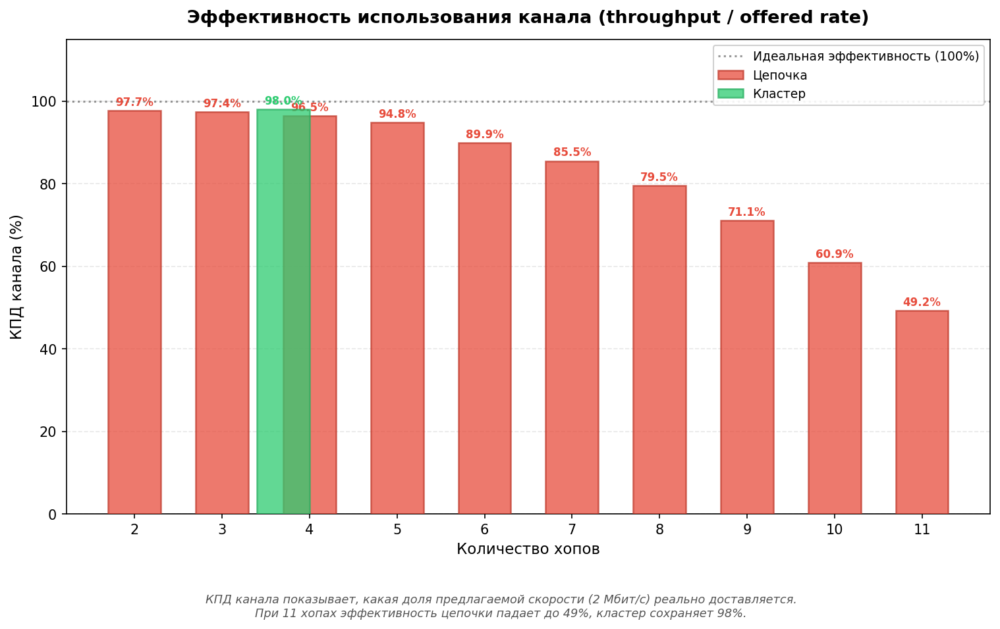
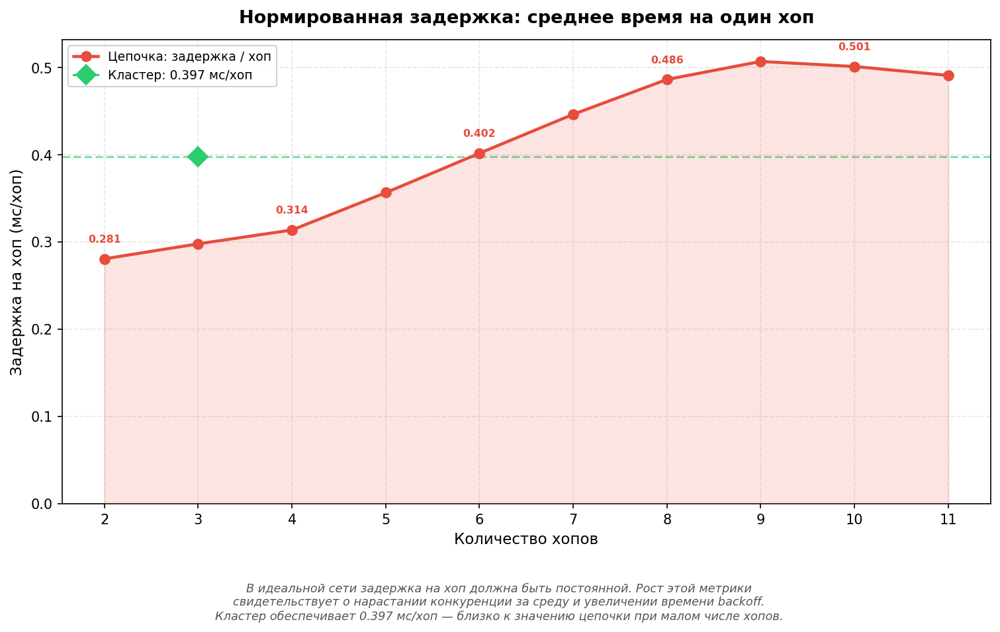
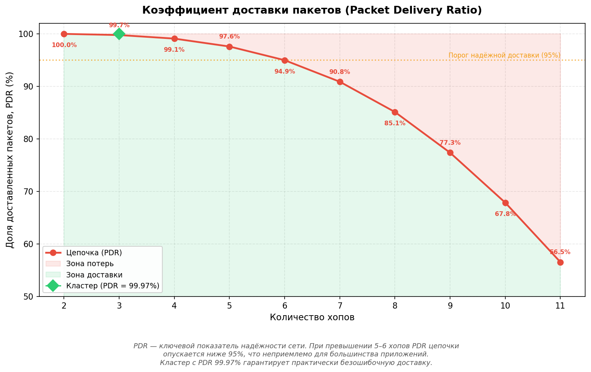
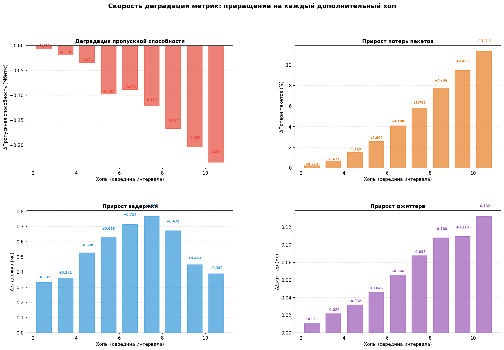
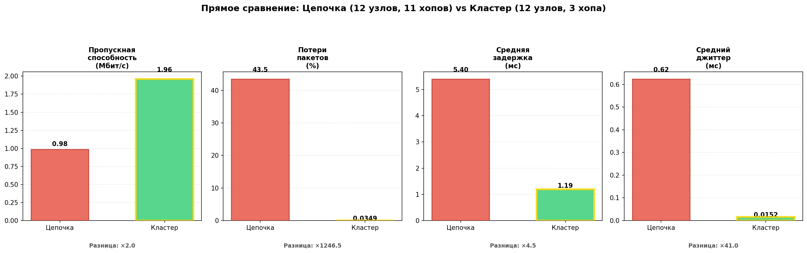
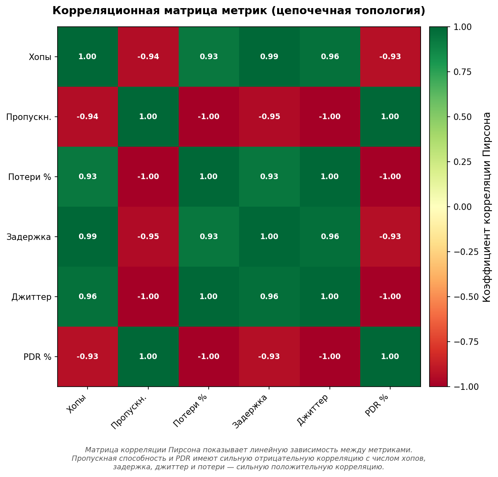

# ОТЧЁТ ПО УЧЕБНОЙ ПРАКТИКЕ

**Тема:** «Симуляция и сравнительный анализ беспроводных сетевых топологий в среде Linux с использованием сетевого симулятора ns-3»

---

## СОДЕРЖАНИЕ

Введение ........................................................................................................................ 3

1 Теоретические основы .............................................................................................. 5

  1.1 Сетевой симулятор ns-3 ...................................................................................... 5

  1.2 Беспроводные сетевые топологии ..................................................................... 6

  1.3 Протокол маршрутизации OLSR ....................................................................... 7

  1.4 Стандарт IEEE 802.11n ...................................................................................... 8

2 Описание среды разработки и инструментов .......................................................... 9

  2.1 Операционная система Linux ............................................................................. 9

  2.2 Установка и настройка ns-3 ............................................................................... 9

  2.3 Средства визуализации результатов ................................................................ 10

3 Разработка симуляционной модели ........................................................................ 11

  3.1 Структура программы ...................................................................................... 11

  3.2 Общие параметры симуляции .......................................................................... 12

  3.3 Настройка Wi-Fi канала и физического уровня ............................................. 13

  3.4 Реализация цепочечной топологии (Chain) .................................................... 16

  3.5 Реализация кластерной топологии (Cluster) ................................................... 20

  3.6 Сбор статистики и экспорт результатов .......................................................... 26

4 Визуализация результатов ...................................................................................... 30

  4.1 Скрипт построения графиков .......................................................................... 30

  4.2 Графики зависимостей метрик от количества хопов ...................................... 32

  4.3 Параметрическая диаграмма и радарное сравнение ....................................... 37

  4.4 Сводная панель и диаграмма доставки пакетов .............................................. 39

  4.5 КПД канала и эффективность использования полосы пропускания ............. 41

  4.6 Нормированная задержка на хоп ..................................................................... 42

  4.7 Коэффициент доставки пакетов (PDR) ........................................................... 43

  4.8 Скорость деградации метрик ........................................................................... 44

  4.9 Прямое столбчатое сравнение при 12 узлах ................................................... 46

  4.10 Корреляционная матрица метрик ................................................................... 47

5 Анализ результатов симуляции .............................................................................. 49

  5.1 Таблица результатов ........................................................................................ 49

  5.2 Сравнительный анализ топологий ................................................................... 50

  5.3 Анализ эффективности использования канала ................................................ 52

  5.4 Анализ масштабируемости и порогов деградации .......................................... 53

  5.5 Корреляционный анализ метрик ...................................................................... 55

  5.6 Оценка пригодности топологий для различных классов приложений .......... 56

  5.7 Выводы по результатам анализа ..................................................................... 58

Заключение ................................................................................................................. 60

Список использованных источников ......................................................................... 63

---

## ВВЕДЕНИЕ

Беспроводные сети являются неотъемлемой частью современной телекоммуникационной инфраструктуры. Их повсеместное использование в промышленности, транспорте, медицине и повседневной жизни обуславливает необходимость тщательного изучения характеристик различных сетевых топологий и их поведения при масштабировании. Выбор оптимальной топологии беспроводной сети является критически важной задачей, влияющей на пропускную способность, задержку, потери пакетов и общую надёжность системы.

Сетевое моделирование позволяет исследовать поведение сетей без необходимости развёртывания дорогостоящего физического оборудования. Симулятор ns-3 (Network Simulator 3) представляет собой мощный инструмент с открытым исходным кодом, широко применяемый в академической среде и научных исследованиях для моделирования сетевых протоколов и топологий. Он позволяет проводить детальное моделирование на уровне пакетов с высокой степенью достоверности.

Целью данной учебной практики является симуляция и сравнительный анализ двух беспроводных сетевых топологий — цепочечной (chain) и кластерной (cluster) — в среде операционной системы Linux с использованием сетевого симулятора ns-3.

Для достижения поставленной цели были решены следующие задачи:

1. Изучены теоретические основы беспроводных сетевых топологий, стандарта IEEE 802.11n и протокола маршрутизации OLSR.
2. Освоена среда сетевого моделирования ns-3, установленная и настроенная в операционной системе Linux.
3. Разработана программная модель на языке C++, реализующая цепочечную и кластерную топологии с 12 узлами.
4. Проведена серия симуляций с варьированием количества хопов (промежуточных узлов) для цепочечной топологии.
5. Собраны и визуализированы количественные метрики производительности: пропускная способность, потери пакетов, средняя задержка и джиттер.
6. Выполнен сравнительный анализ результатов и сформулированы выводы о преимуществах и недостатках каждой топологии.

Практическая значимость работы заключается в получении количественных данных, которые могут быть использованы при проектировании реальных беспроводных mesh-сетей для выбора оптимальной топологии в зависимости от требований конкретного приложения.

---

## 1 ТЕОРЕТИЧЕСКИЕ ОСНОВЫ

### 1.1 Сетевой симулятор ns-3

NS-3 (Network Simulator version 3) — это дискретно-событийный сетевой симулятор с открытым исходным кодом, предназначенный для исследования и обучения в области компьютерных сетей. Он был разработан как замена устаревшему симулятору ns-2 и написан на языке C++ с возможностью использования привязок к языку Python.

Основные характеристики ns-3:

- дискретно-событийная модель симуляции, обеспечивающая высокую точность моделирования;
- модульная архитектура, позволяющая подключать различные модели протоколов и устройств;
- поддержка широкого спектра сетевых технологий: Wi-Fi (IEEE 802.11a/b/g/n/ac/ax), LTE, 5G NR, WiMAX и других;
- встроенный модуль мониторинга потоков (FlowMonitor) для автоматического сбора статистики;
- интеграция с инструментами визуализации NetAnim для анимации сетевых процессов;
- активное академическое сообщество и регулярные обновления.

В рамках данной работы ns-3 используется для моделирования Wi-Fi сети стандарта 802.11n с протоколом маршрутизации OLSR, включая моделирование физического уровня (PHY), канального уровня (MAC) и сетевого уровня (IP/маршрутизация).

### 1.2 Беспроводные сетевые топологии

В данной работе исследуются две топологии беспроводной сети:

**Цепочечная топология (Chain)** — линейное расположение узлов, при котором каждый узел может взаимодействовать только с ближайшими соседями. Трафик от источника к приёмнику передаётся последовательно через промежуточные узлы (хопы). Все узлы используют один радиоканал, что приводит к конкуренции за среду передачи и коллизиям по мере увеличения числа хопов. Данная топология характерна для простейших mesh-сетей и сценариев ретрансляции.

**Кластерная топология (Cluster)** — иерархическое расположение узлов, при котором сеть разделена на кластеры (группы). Каждый кластер имеет мастер-узел, который координирует работу подчинённых узлов внутри кластера. Мастер-узлы соединены между собой магистральным каналом (backbone). Ключевое преимущество — возможность использования разных частотных каналов в разных кластерах, что существенно снижает интерференцию и повышает пропускную способность.

### 1.3 Протокол маршрутизации OLSR

OLSR (Optimized Link State Routing) — проактивный протокол маршрутизации для мобильных ad-hoc сетей (MANET). Он основан на алгоритме состояния каналов и использует концепцию многоточечных ретрансляторов (MPR) для оптимизации распространения управляющих сообщений.

Основные особенности OLSR:

- проактивный характер: таблицы маршрутизации формируются заранее, до поступления трафика данных;
- использование MPR (MultiPoint Relays) для снижения накладных расходов на рассылку служебных сообщений;
- периодический обмен сообщениями HELLO (обнаружение соседей) и TC (Topology Control — информация о топологии);
- подходит для сетей с умеренной мобильностью и достаточным временем конвергенции.

В контексте данной работы протокол OLSR обеспечивает автоматическое построение маршрутов от узла-источника к узлу-приёмнику через промежуточные узлы без ручной настройки статических маршрутов. Время симуляции (80 секунд) обеспечивает достаточный период конвергенции OLSR (порядка 15–20 секунд), после чего начинается передача данных.

### 1.4 Стандарт IEEE 802.11n

IEEE 802.11n (Wi-Fi 4) — стандарт беспроводной связи, обеспечивающий максимальную теоретическую скорость передачи данных до 600 Мбит/с при использовании технологии MIMO (Multiple-Input Multiple-Output) и каналов шириной 40 МГц.

В данной симуляции используются следующие параметры стандарта 802.11n:

- режим передачи данных: HtMcs3 (MCS index 3, обеспечивающий скорость до 26 Мбит/с при канале 20 МГц);
- управляющий режим: HtMcs0 (базовый режим для служебных кадров);
- мощность передатчика: 20 дБм (100 мВт);
- механизм доступа к среде: CSMA/CA (Carrier Sense Multiple Access with Collision Avoidance) в режиме Ad-Hoc;
- предлагаемая скорость трафика: 2 Мбит/с (UDP).

Выбор относительно низкой предлагаемой скорости (2 Мбит/с) обусловлен необходимостью наглядной демонстрации деградации производительности при увеличении числа хопов в цепочечной топологии, когда единственный радиоканал разделяется между всеми узлами.

---

## 2 ОПИСАНИЕ СРЕДЫ РАЗРАБОТКИ И ИНСТРУМЕНТОВ

### 2.1 Операционная система Linux

Для выполнения учебной практики использовалась операционная система на базе ядра Linux (дистрибутив Ubuntu). Linux является предпочтительной платформой для работы с ns-3 по следующим причинам:

- полная поддержка компилятора GCC и системы сборки CMake/Waf, необходимых для компиляции ns-3;
- наличие развитых средств управления пакетами (apt) для установки зависимостей;
- совместимость с инструментами научного программирования (Python, matplotlib, numpy);
- стабильность и производительность при выполнении длительных симуляций.

### 2.2 Установка и настройка ns-3

Установка ns-3 в среде Linux выполняется следующим образом:

1. Установка необходимых зависимостей через системный менеджер пакетов:

```bash
sudo apt update
sudo apt install gcc g++ python3 python3-dev python3-pip \
     cmake ninja-build git libgsl-dev libsqlite3-dev
```

2. Клонирование репозитория ns-3 и сборка:

```bash
git clone https://gitlab.com/nsnam/ns-3-dev.git ns-3
cd ns-3
./ns3 configure --enable-examples --enable-tests
./ns3 build
```

3. Проверка работоспособности:

```bash
./ns3 run hello-simulator
```

4. Копирование исследовательского скрипта в директорию scratch и его запуск:

```bash
cp wifi-research.cc scratch/
./ns3 run scratch/wifi-research
```

### 2.3 Средства визуализации результатов

Для построения графиков и визуализации результатов симуляции используется язык Python 3 со следующими библиотеками:

- **matplotlib** (версия 3.10) — библиотека для создания статических, анимированных и интерактивных визуализаций;
- **numpy** (версия 2.4) — библиотека для работы с многомерными массивами и математическими вычислениями.

Установка библиотек визуализации:

```bash
pip3 install matplotlib numpy
```

---

## 3 РАЗРАБОТКА СИМУЛЯЦИОННОЙ МОДЕЛИ

### 3.1 Структура программы

Программа симуляции написана на языке C++ и использует API ns-3. Файл `wifi-research.cc` содержит следующие основные компоненты:

- подключение необходимых модулей ns-3;
- определение глобальных параметров симуляции;
- структура `FlowResult` для хранения результатов каждого потока;
- функция `CollectStats()` для сбора статистики с FlowMonitor;
- функция `WriteCSV()` для экспорта результатов в формат CSV;
- функция `SetupWifi()` для настройки параметров Wi-Fi;
- функция `CreateChannel()` для создания радиоканала;
- функция `RunChain()` для запуска цепочечной топологии;
- функция `RunCluster()` для запуска кластерной топологии;
- функция `main()` для управления режимом работы программы.

Подключение необходимых модулей ns-3 выполняется в начале файла:

```cpp
#include "ns3/core-module.h"
#include "ns3/network-module.h"
#include "ns3/mobility-module.h"
#include "ns3/wifi-module.h"
#include "ns3/internet-module.h"
#include "ns3/applications-module.h"
#include "ns3/flow-monitor-module.h"
#include "ns3/netanim-module.h"
#include "ns3/olsr-helper.h"
#include "ns3/propagation-module.h"

#include <fstream>
#include <iomanip>

using namespace ns3;

NS_LOG_COMPONENT_DEFINE("WifiResearch");
```

Каждый подключаемый модуль предоставляет определённый набор классов и функций:

- `core-module.h` — базовые классы ядра ns-3 (Simulator, Time, CommandLine);
- `network-module.h` — абстракции сетевых устройств и пакетов;
- `mobility-module.h` — модели мобильности и позиционирования узлов;
- `wifi-module.h` — модели Wi-Fi PHY и MAC уровней;
- `internet-module.h` — стек TCP/IP (IPv4, UDP, TCP);
- `applications-module.h` — приложения-генераторы и приёмники трафика;
- `flow-monitor-module.h` — модуль мониторинга потоков для сбора статистики;
- `netanim-module.h` — интерфейс для создания XML-анимаций;
- `olsr-helper.h` — помощник настройки протокола маршрутизации OLSR;
- `propagation-module.h` — модели распространения радиосигнала.

Макрос `NS_LOG_COMPONENT_DEFINE("WifiResearch")` регистрирует компонент логирования, позволяющий выводить отладочную информацию в процессе симуляции.

### 3.2 Общие параметры симуляции

Глобальные параметры задают условия симуляции, единые для обеих топологий:

```cpp
double simTime = 80.0;
uint32_t packetSize = 1024;
std::string offeredRate = "2Mbps";
```

- `simTime = 80.0` — общее время симуляции составляет 80 секунд. Это значение выбрано с учётом необходимости конвергенции протокола OLSR (первые 15–20 секунд), после чего остаётся достаточный период для генерации и передачи трафика;
- `packetSize = 1024` — размер одного UDP-пакета составляет 1024 байта, что является типичным значением для сетевых исследований;
- `offeredRate = "2Mbps"` — предлагаемая скорость генерации трафика составляет 2 Мбит/с. Данное значение значительно ниже максимальной пропускной способности канала, что позволяет наглядно отследить деградацию при многопрыжковой (multi-hop) передаче.

### 3.3 Настройка Wi-Fi канала и физического уровня

Для настройки Wi-Fi используются две вспомогательные функции: `CreateChannel()` и `SetupWifi()`.

Функция создания радиоканала `CreateChannel()`:

```cpp
Ptr<YansWifiChannel>
CreateChannel(double range)
{
    YansWifiChannelHelper channelHelper;

    channelHelper.SetPropagationDelay(
        "ns3::ConstantSpeedPropagationDelayModel");

    channelHelper.AddPropagationLoss(
        "ns3::RangePropagationLossModel",
        "MaxRange",
        DoubleValue(range));

    return channelHelper.Create();
}
```

Данная функция создаёт радиоканал со следующими характеристиками:

- модель задержки распространения `ConstantSpeedPropagationDelayModel` — вычисляет задержку распространения на основе скорости света и расстояния между узлами;
- модель потерь распространения `RangePropagationLossModel` — бинарная модель, при которой сигнал полностью доступен на расстоянии меньше `MaxRange` и полностью недоступен за его пределами. Параметр `range` определяет максимальную дальность связи в метрах.

Функция настройки Wi-Fi `SetupWifi()`:

```cpp
void SetupWifi(WifiHelper& wifi,
               WifiMacHelper& mac,
               YansWifiPhyHelper& phy,
               Ptr<YansWifiChannel> channel)
{
    wifi.SetStandard(WIFI_STANDARD_80211n);

    wifi.SetRemoteStationManager(
        "ns3::ConstantRateWifiManager",
        "DataMode",
        StringValue("HtMcs3"),
        "ControlMode",
        StringValue("HtMcs0"));

    mac.SetType("ns3::AdhocWifiMac");

    phy.SetChannel(channel);

    phy.Set("TxPowerStart", DoubleValue(20));
    phy.Set("TxPowerEnd", DoubleValue(20));
}
```

Детальное описание настроек:

- `WIFI_STANDARD_80211n` — устанавливается стандарт Wi-Fi 802.11n (Wi-Fi 4);
- `ConstantRateWifiManager` — менеджер, использующий фиксированную скорость передачи (без адаптивной модуляции), что обеспечивает детерминированность результатов;
- `HtMcs3` — индекс модуляции и кодирования (MCS 3), соответствующий 16-QAM с кодовой скоростью 1/2, обеспечивающий скорость 26 Мбит/с при канале 20 МГц;
- `HtMcs0` — базовый индекс для управляющих кадров (BPSK, кодовая скорость 1/2);
- `AdhocWifiMac` — режим Ad-Hoc (каждый узел равноправен, без точки доступа);
- `TxPowerStart = TxPowerEnd = 20` дБм — фиксированная мощность передатчика 100 мВт.

### 3.4 Реализация цепочечной топологии (Chain)

Функция `RunChain()` реализует цепочечную топологию, состоящую из 12 узлов, расположенных в линию. Ниже приводится полный код функции с подробными пояснениями.

**Создание узлов и настройка Wi-Fi:**

```cpp
void RunChain()
{
    NodeContainer nodes;
    nodes.Create(12);

    WifiHelper wifi;
    WifiMacHelper mac;
    YansWifiPhyHelper phy;

    Ptr<YansWifiChannel> channel =
        CreateChannel(18.0);

    SetupWifi(wifi, mac, phy, channel);

    NetDeviceContainer devices =
        wifi.Install(phy, mac, nodes);
```

Создаётся контейнер из 12 узлов. Все узлы подключаются к одному радиоканалу с дальностью связи 18 метров. При расположении узлов через 10 метров друг от друга каждый узел может связаться только с ближайшими соседями (расстояние 10 м < 18 м), но не через один (расстояние 20 м > 18 м). Это обеспечивает строго цепочечную маршрутизацию.

**Размещение узлов:**

```cpp
    MobilityHelper mobility;

    Ptr<ListPositionAllocator> pos =
        CreateObject<ListPositionAllocator>();

    for (int i = 0; i < 12; ++i)
    {
        pos->Add(Vector(i * 10.0, 0, 0));
    }

    mobility.SetPositionAllocator(pos);
    mobility.SetMobilityModel(
        "ns3::ConstantPositionMobilityModel");
    mobility.Install(nodes);
```

Узлы размещаются на прямой линии с шагом 10 метров: Node0 в точке (0, 0, 0), Node1 в точке (10, 0, 0), ..., Node11 в точке (110, 0, 0). Используется модель `ConstantPositionMobilityModel`, означающая, что узлы неподвижны в течение всей симуляции.

**Настройка маршрутизации и IP-адресации:**

```cpp
    OlsrHelper olsr;
    InternetStackHelper internet;
    internet.SetRoutingHelper(olsr);
    internet.Install(nodes);

    Ipv4AddressHelper ipv4;
    ipv4.SetBase("10.1.0.0", "255.255.255.0");
    Ipv4InterfaceContainer interfaces =
        ipv4.Assign(devices);
```

На каждый узел устанавливается интернет-стек (IPv4, UDP, TCP) с протоколом маршрутизации OLSR. Узлам назначаются IP-адреса из подсети 10.1.0.0/24.

**Настройка приложений (генерация и приём трафика):**

```cpp
    uint16_t port = 5000;

    PacketSinkHelper sinkHelper(
        "ns3::UdpSocketFactory",
        InetSocketAddress(Ipv4Address::GetAny(), port));

    auto sink = sinkHelper.Install(nodes.Get(11));
    sink.Start(Seconds(1.0));
    sink.Stop(Seconds(simTime));

    OnOffHelper onoff(
        "ns3::UdpSocketFactory",
        InetSocketAddress(interfaces.GetAddress(11), port));

    onoff.SetConstantRate(
        DataRate(offeredRate), packetSize);

    auto app = onoff.Install(nodes.Get(0));
    app.Start(Seconds(20.0));
    app.Stop(Seconds(simTime - 1));
```

Приложение `PacketSink` устанавливается на последний узел (Node11) и начинает приём пакетов с 1-й секунды. Приложение `OnOff` (генератор трафика) устанавливается на первый узел (Node0) и начинает отправку пакетов с 20-й секунды. Задержка в 20 секунд необходима для завершения конвергенции протокола OLSR — к этому моменту все маршруты уже построены. Трафик передаётся по протоколу UDP на порт 5000 со скоростью 2 Мбит/с, размер пакета — 1024 байта.

**Мониторинг, визуализация и запуск:**

```cpp
    FlowMonitorHelper flowHelper;
    Ptr<FlowMonitor> monitor = flowHelper.InstallAll();

    AnimationInterface anim("chain.xml");
    for (uint32_t i = 0; i < nodes.GetN(); ++i)
    {
        anim.UpdateNodeDescription(
            nodes.Get(i),
            "N" + std::to_string(i + 1));
        anim.UpdateNodeColor(nodes.Get(i), 0, 200, 0);
    }
    anim.UpdateNodeColor(nodes.Get(0), 255, 100, 0);
    anim.UpdateNodeColor(nodes.Get(11), 255, 0, 0);

    Simulator::Stop(Seconds(simTime));
    Simulator::Run();

    auto results = CollectStats(monitor, flowHelper,
                                "CHAIN (sequential)");
    WriteCSV("chain-results.csv", "chain", results);

    monitor->SerializeToXmlFile(
        "chain-results.xml", true, true);

    Simulator::Destroy();
}
```

`FlowMonitor` устанавливается на все узлы для автоматического сбора статистики по каждому потоку. `AnimationInterface` создаёт XML-файл анимации для визуализации в NetAnim: узлы окрашиваются в зелёный цвет, источник (Node0) — в оранжевый, приёмник (Node11) — в красный. После завершения симуляции вызывается `CollectStats()` для сбора метрик, результаты экспортируются в CSV-файл, а детальная статистика FlowMonitor сохраняется в XML.

### 3.5 Реализация кластерной топологии (Cluster)

Функция `RunCluster()` реализует кластерную топологию, состоящую из трёх кластеров по четыре узла, соединённых магистральной (backbone) сетью. Данная топология использует пространственное частотное разделение для минимизации интерференции.

**Создание узлов:**

```cpp
void RunCluster()
{
    NodeContainer masters;
    masters.Create(3);

    NodeContainer slaves1;
    slaves1.Create(3);

    NodeContainer slaves2;
    slaves2.Create(3);

    NodeContainer slaves3;
    slaves3.Create(3);

    NodeContainer all;
    all.Add(masters);
    all.Add(slaves1);
    all.Add(slaves2);
    all.Add(slaves3);
```

Создаются четыре группы узлов:

- `masters` — три мастер-узла (M1, M2, M3), выполняющие роль шлюзов между кластерами;
- `slaves1`, `slaves2`, `slaves3` — по три подчинённых узла в каждом кластере;
- `all` — объединённый контейнер всех 12 узлов.

**Создание раздельных радиоканалов:**

```cpp
    Ptr<YansWifiChannel> ch1 = CreateChannel(25.0);
    Ptr<YansWifiChannel> ch2 = CreateChannel(25.0);
    Ptr<YansWifiChannel> ch3 = CreateChannel(25.0);
    Ptr<YansWifiChannel> backboneCh = CreateChannel(80.0);

    WifiHelper wifi1, wifi2, wifi3, wifiBackbone;
    WifiMacHelper mac1, mac2, mac3, macBackbone;
    YansWifiPhyHelper phy1, phy2, phy3, phyBackbone;

    SetupWifi(wifi1, mac1, phy1, ch1);
    SetupWifi(wifi2, mac2, phy2, ch2);
    SetupWifi(wifi3, mac3, phy3, ch3);
    SetupWifi(wifiBackbone, macBackbone,
              phyBackbone, backboneCh);
```

Ключевое отличие от цепочечной топологии — создание четырёх независимых радиоканалов:

- `ch1` (дальность 25 м) — канал первого кластера;
- `ch2` (дальность 25 м) — канал второго кластера;
- `ch3` (дальность 25 м) — канал третьего кластера;
- `backboneCh` (дальность 80 м) — магистральный канал между мастер-узлами.

Поскольку каждый кластер использует свой физический канал (в реальности — отдельную частоту), передачи в разных кластерах не создают взаимной интерференции. Увеличенная дальность магистрального канала (80 м) обеспечивает прямую связь между мастер-узлами.

**Формирование кластеров и установка устройств:**

```cpp
    NodeContainer cluster1;
    cluster1.Add(masters.Get(0));
    cluster1.Add(slaves1);

    NodeContainer cluster2;
    cluster2.Add(masters.Get(1));
    cluster2.Add(slaves2);

    NodeContainer cluster3;
    cluster3.Add(masters.Get(2));
    cluster3.Add(slaves3);

    auto dev1 = wifi1.Install(phy1, mac1, cluster1);
    auto dev2 = wifi2.Install(phy2, mac2, cluster2);
    auto dev3 = wifi3.Install(phy3, mac3, cluster3);
    auto backbone = wifiBackbone.Install(
        phyBackbone, macBackbone, masters);
```

Каждый кластер включает один мастер-узел и три подчинённых узла. Мастер-узлы дополнительно оснащаются магистральным сетевым интерфейсом для межкластерной связи. Таким образом, каждый мастер-узел имеет два сетевых интерфейса: один для внутрикластерной связи и один для магистральной.

**Размещение узлов в пространстве:**

```cpp
    MobilityHelper mobility;

    Ptr<ListPositionAllocator> pos =
        CreateObject<ListPositionAllocator>();

    pos->Add(Vector(0, 0, 0));      // M1
    pos->Add(Vector(40, 0, 0));     // M2
    pos->Add(Vector(80, 0, 0));     // M3

    pos->Add(Vector(-10, 10, 0));   // S1.1
    pos->Add(Vector(-10, -10, 0));  // S1.2
    pos->Add(Vector(-20, 0, 0));    // S1.3

    pos->Add(Vector(30, 10, 0));    // S2.1
    pos->Add(Vector(30, -10, 0));   // S2.2
    pos->Add(Vector(20, 0, 0));     // S2.3

    pos->Add(Vector(90, 10, 0));    // S3.1
    pos->Add(Vector(90, -10, 0));   // S3.2
    pos->Add(Vector(100, 0, 0));    // S3.3

    mobility.SetPositionAllocator(pos);
    mobility.SetMobilityModel(
        "ns3::ConstantPositionMobilityModel");
    mobility.Install(all);
```

Мастер-узлы размещены на оси X с шагом 40 метров: M1(0,0), M2(40,0), M3(80,0). Подчинённые узлы каждого кластера расположены вокруг своего мастера на расстоянии 10–20 метров. Такое расположение гарантирует, что подчинённые узлы находятся в зоне покрытия своего мастера (< 25 м), но за пределами досягаемости узлов других кластеров.

**Настройка IP-адресации:**

```cpp
    OlsrHelper olsr;
    InternetStackHelper internet;
    internet.SetRoutingHelper(olsr);
    internet.Install(all);

    Ipv4AddressHelper ipv4;

    ipv4.SetBase("10.1.1.0", "255.255.255.0");
    auto if1 = ipv4.Assign(dev1);

    ipv4.SetBase("10.1.2.0", "255.255.255.0");
    auto if2 = ipv4.Assign(dev2);

    ipv4.SetBase("10.1.3.0", "255.255.255.0");
    auto if3 = ipv4.Assign(dev3);

    ipv4.SetBase("10.1.10.0", "255.255.255.0");
    auto ifBackbone = ipv4.Assign(backbone);
```

Каждому кластеру и магистральной сети назначается отдельная IP-подсеть:

- Кластер 1: 10.1.1.0/24;
- Кластер 2: 10.1.2.0/24;
- Кластер 3: 10.1.3.0/24;
- Магистраль: 10.1.10.0/24.

Протокол OLSR автоматически обнаруживает и связывает все подсети через мастер-узлы.

**Настройка приложений:**

```cpp
    uint16_t port = 6000;

    PacketSinkHelper sinkHelper(
        "ns3::UdpSocketFactory",
        InetSocketAddress(Ipv4Address::GetAny(), port));

    auto sink = sinkHelper.Install(slaves3.Get(2));
    sink.Start(Seconds(1.0));
    sink.Stop(Seconds(simTime));

    OnOffHelper onoff(
        "ns3::UdpSocketFactory",
        InetSocketAddress(if3.GetAddress(3), port));

    onoff.SetConstantRate(
        DataRate(offeredRate), packetSize);

    auto app = onoff.Install(slaves1.Get(0));
    app.Start(Seconds(20.0));
    app.Stop(Seconds(simTime - 1));
```

Источник трафика — узел S1.1 (подчинённый узел первого кластера). Приёмник — узел S3.3 (подчинённый узел третьего кластера). Маршрут передачи: S1.1 → M1 → M2 → M3 → S3.3 (3 хопа), при этом каждый хоп использует свой частотный канал:

- S1.1 → M1: канал 1 (ch1);
- M1 → M2 → M3: магистральный канал (backboneCh);
- M3 → S3.3: канал 3 (ch3).

**Визуализация и запуск:**

```cpp
    FlowMonitorHelper flowHelper;
    Ptr<FlowMonitor> monitor = flowHelper.InstallAll();

    AnimationInterface anim("cluster.xml");

    std::string masterNames[] = {"M1", "M2", "M3"};
    for (uint32_t i = 0; i < masters.GetN(); ++i)
    {
        anim.UpdateNodeDescription(
            masters.Get(i), masterNames[i]);
        anim.UpdateNodeColor(
            masters.Get(i), 255, 0, 0);
    }

    std::string slaveNames1[] =
        {"S1.1", "S1.2", "S1.3"};
    std::string slaveNames2[] =
        {"S2.1", "S2.2", "S2.3"};
    std::string slaveNames3[] =
        {"S3.1", "S3.2", "S3.3"};

    for (uint32_t i = 0; i < 3; ++i)
    {
        anim.UpdateNodeDescription(
            slaves1.Get(i), slaveNames1[i]);
        anim.UpdateNodeColor(
            slaves1.Get(i), 0, 100, 255);

        anim.UpdateNodeDescription(
            slaves2.Get(i), slaveNames2[i]);
        anim.UpdateNodeColor(
            slaves2.Get(i), 0, 100, 255);

        anim.UpdateNodeDescription(
            slaves3.Get(i), slaveNames3[i]);
        anim.UpdateNodeColor(
            slaves3.Get(i), 0, 100, 255);
    }

    anim.UpdateNodeColor(
        slaves1.Get(0), 255, 165, 0);
    anim.UpdateNodeColor(
        slaves3.Get(2), 255, 0, 255);

    Simulator::Stop(Seconds(simTime));
    Simulator::Run();

    auto results = CollectStats(
        monitor, flowHelper,
        "CLUSTER (grouped by frequency)");
    WriteCSV("cluster-results.csv",
             "cluster", results);

    monitor->SerializeToXmlFile(
        "cluster-results.xml", true, true);

    Simulator::Destroy();
}
```

В анимации кластерной топологии мастер-узлы окрашены красным, подчинённые — синим, источник (S1.1) — оранжевым, а приёмник (S3.3) — фиолетовым.

### 3.6 Сбор статистики и экспорт результатов

Для автоматического сбора статистики используется модуль FlowMonitor ns-3, обеспечивающий отслеживание каждого IP-потока. Функция `CollectStats()` обрабатывает данные FlowMonitor и формирует удобную структуру результатов.

**Структура данных результатов:**

```cpp
struct FlowResult
{
    uint32_t flowId;
    std::string src;
    std::string dst;
    uint32_t txPackets;
    uint32_t rxPackets;
    double packetLoss;
    double throughputMbps;
    double delayS;
    double jitterS;
    uint64_t txBytes;
    uint64_t rxBytes;
};
```

Каждая запись содержит:

- идентификатор потока (`flowId`);
- адреса источника и назначения (`src`, `dst`);
- количество отправленных и полученных пакетов (`txPackets`, `rxPackets`);
- процент потерь пакетов (`packetLoss`);
- пропускную способность в мегабитах в секунду (`throughputMbps`);
- среднюю задержку в секундах (`delayS`);
- средний джиттер в секундах (`jitterS`);
- объём переданных и полученных данных в байтах (`txBytes`, `rxBytes`).

**Функция сбора статистики:**

```cpp
std::vector<FlowResult>
CollectStats(Ptr<FlowMonitor> monitor,
             FlowMonitorHelper& helper,
             std::string name)
{
    monitor->CheckForLostPackets();

    Ptr<Ipv4FlowClassifier> classifier =
        DynamicCast<Ipv4FlowClassifier>(
            helper.GetClassifier());

    auto stats = monitor->GetFlowStats();
    std::vector<FlowResult> results;

    for (auto const& flow : stats)
    {
        auto t = classifier->FindFlow(flow.first);
        FlowResult r;
        r.flowId = flow.first;

        std::ostringstream srcStr, dstStr;
        t.sourceAddress.Print(srcStr);
        t.destinationAddress.Print(dstStr);
        r.src = srcStr.str();
        r.dst = dstStr.str();

        r.txPackets = flow.second.txPackets;
        r.rxPackets = flow.second.rxPackets;
        r.txBytes = flow.second.txBytes;
        r.rxBytes = flow.second.rxBytes;

        if (flow.second.rxPackets == 0)
        {
            r.packetLoss = 100.0;
            r.throughputMbps = 0.0;
            r.delayS = 0.0;
            r.jitterS = 0.0;
        }
        else
        {
            double duration =
                flow.second.timeLastRxPacket.GetSeconds()
                - flow.second.timeFirstTxPacket
                      .GetSeconds();

            r.throughputMbps = (duration > 0)
                ? flow.second.rxBytes * 8.0
                  / duration / 1e6
                : 0.0;

            r.delayS =
                flow.second.delaySum.GetSeconds()
                / flow.second.rxPackets;

            r.jitterS =
                flow.second.jitterSum.GetSeconds()
                / flow.second.rxPackets;

            r.packetLoss =
                (r.txPackets > 0)
                ? ((r.txPackets - r.rxPackets)
                   * 100.0 / r.txPackets)
                : 0.0;
        }

        results.push_back(r);
    }

    return results;
}
```

Алгоритм сбора статистики:

1. Вызов `CheckForLostPackets()` для обнаружения пакетов, которые были отправлены, но не получены до конца симуляции.
2. Получение классификатора потоков для определения IP-адресов источника и назначения.
3. Для каждого потока вычисляются метрики:
   - **пропускная способность** = (принятые байты × 8) / время / 10^6 (Мбит/с);
   - **средняя задержка** = суммарная задержка / количество принятых пакетов;
   - **средний джиттер** = суммарный джиттер / количество принятых пакетов;
   - **потери пакетов** = (отправлено − принято) / отправлено × 100 (%).

**Функция экспорта в CSV:**

```cpp
void WriteCSV(const std::string& filename,
              const std::string& topology,
              const std::vector<FlowResult>& results)
{
    std::ofstream f(filename);
    f << "topology,flow_id,src,dst,tx_packets,"
      << "rx_packets,tx_bytes,rx_bytes,"
      << "packet_loss_pct,throughput_mbps,"
      << "avg_delay_ms,avg_jitter_ms\n";

    for (auto& r : results)
    {
        f << topology << ","
          << r.flowId << ","
          << r.src << ","
          << r.dst << ","
          << r.txPackets << ","
          << r.rxPackets << ","
          << r.txBytes << ","
          << r.rxBytes << ","
          << std::fixed << std::setprecision(6)
          << r.packetLoss << ","
          << r.throughputMbps << ","
          << r.delayS * 1000.0 << ","
          << r.jitterS * 1000.0 << "\n";
    }
    f.close();
}
```

Функция записывает результаты в файл формата CSV, пригодный для последующего анализа в Python. Значения задержки и джиттера конвертируются из секунд в миллисекунды для удобства восприятия.

**Управление режимом работы (функция main):**

```cpp
int main(int argc, char* argv[])
{
    std::string mode = "both";

    CommandLine cmd;
    cmd.AddValue("mode",
        "Run mode: chain, cluster, or both", mode);
    cmd.Parse(argc, argv);

    if (mode == "chain" || mode == "both")
    {
        RunChain();
    }

    if (mode == "cluster" || mode == "both")
    {
        RunCluster();
    }

    return 0;
}
```

Функция `main()` использует механизм командной строки ns-3 для выбора режима:

- `--mode=chain` — запуск только цепочечной топологии;
- `--mode=cluster` — запуск только кластерной топологии;
- `--mode=both` (по умолчанию) — последовательный запуск обеих топологий.

---

## 4 ВИЗУАЛИЗАЦИЯ РЕЗУЛЬТАТОВ

### 4.1 Скрипт построения графиков

Для визуализации результатов симуляции разработан скрипт `plot_results.py` на языке Python, который считывает файл `sweep-results.csv` (содержащий результаты серии запусков с различным количеством узлов) и строит восемь типов графиков.

Файл `sweep-results.csv` содержит результаты 10 запусков цепочечной топологии (от 3 до 12 узлов, то есть от 2 до 11 хопов) и одного запуска кластерной топологии (12 узлов, 3 хопа). Скрипт загружает данные с помощью модуля `csv` и разделяет их на записи цепочечной и кластерной топологий.

### 4.2 Графики зависимостей метрик от количества хопов

**График 1 — Зависимость пропускной способности от количества хопов**


Рисунок 4.1 — Зависимость пропускной способности от количества хопов

На рисунке 4.1 показана зависимость пропускной способности от количества хопов для цепочечной и кластерной топологий. Красная линия с круглыми маркерами отображает результаты цепочечной топологии, зелёная пунктирная горизонтальная линия с ромбовидным маркером — результат кластерной топологии.

С увеличением числа хопов от 2 до 11 пропускная способность цепочечной топологии снижается с 1.95 до 0.98 Мбит/с (падение на 50 %). Это объясняется тем, что все узлы используют один радиоканал и механизм CSMA/CA вынуждает каждый узел ожидать освобождения среды перед передачей. Кластерная топология при 3 хопах обеспечивает пропускную способность 1.96 Мбит/с — практически без потерь.

**График 2 — Зависимость потерь пакетов от количества хопов**


Рисунок 4.2 — Зависимость потерь пакетов от количества хопов

На рисунке 4.2 представлена зависимость процента потерь пакетов от количества хопов. Потери пакетов в цепочечной топологии возрастают экспоненциально: от 0.04 % при 2 хопах до 43.5 % при 11 хопах. Кластерная топология демонстрирует потери 0.03 % — практически нулевые.

Рост потерь обусловлен кумулятивной вероятностью коллизий: каждый промежуточный узел добавляет риск переполнения очереди и исчерпания повторных попыток передачи.

**График 3 — Зависимость средней задержки от количества хопов**


Рисунок 4.3 — Зависимость средней задержки от количества хопов

На рисунке 4.3 показана зависимость средней задержки от числа хопов. Задержка растёт приблизительно линейно с 0.56 мс (2 хопа) до 5.40 мс (11 хопов), что соответствует среднему приращению ~0.5 мс на каждый дополнительный хоп. Каждый хоп добавляет задержку CSMA/CA backoff, время передачи кадра и ожидание в очереди.

Кластерная топология при 3 хопах обеспечивает задержку 1.19 мс — значительно ниже, чем у цепочки с аналогичным числом узлов.

**График 4 — Зависимость среднего джиттера от количества хопов**


Рисунок 4.4 — Зависимость среднего джиттера от количества хопов

На рисунке 4.4 представлена зависимость среднего джиттера (вариации задержки) от количества хопов. Джиттер увеличивается с 0.008 мс (2 хопа) до 0.623 мс (11 хопов). Рост джиттера обусловлен накоплением случайных интервалов CSMA/CA backoff и переменной длиной очередей.

Кластерная топология обеспечивает джиттер 0.015 мс, что делает её пригодной для приложений реального времени (VoIP, видеоконференции).

### 4.3 Параметрическая диаграмма и радарное сравнение

**График 5 — Зависимость пропускной способности от задержки (параметрическая диаграмма)**


Рисунок 4.5 — Зависимость пропускной способности от задержки (параметрическая диаграмма)

На рисунке 4.5 показана параметрическая диаграмма, где каждая точка соответствует цепочечной топологии с определённым числом хопов. Цвет точки (от жёлтого к красному) отражает количество хопов. Зелёный ромб обозначает кластерную топологию.

Диаграмма наглядно демонстрирует, что с увеличением числа хопов точки смещаются вправо (рост задержки) и вниз (снижение пропускной способности). Кластерная топология находится в «идеальном» углу диаграммы — минимальная задержка при максимальной пропускной способности.

**График 6 — Радарная диаграмма нормированного сравнения**


Рисунок 4.6 — Нормированное сравнение производительности (цепочка 12 узлов vs кластер 12 узлов)

На рисунке 4.6 представлена радарная диаграмма, сравнивающая нормированные показатели цепочечной (11 хопов) и кластерной (3 хопа) топологий при одинаковом количестве узлов (12). Все метрики нормированы так, чтобы лучший результат соответствовал значению 1.0.

Зелёная область (кластер) значительно превосходит красную область (цепочка) по всем пяти показателям:

- пропускная способность;
- обратная величина потерь пакетов;
- обратная величина задержки;
- обратная величина джиттера;
- доля доставленных пакетов.

### 4.4 Сводная панель и диаграмма доставки пакетов

**График 7 — Сводная панель (2×2)**


Рисунок 4.7 — Сводная панель зависимостей метрик от количества хопов

На рисунке 4.7 представлена сводная панель, объединяющая четыре основные зависимости на одном листе для удобства комплексного анализа. Данный формат позволяет одновременно наблюдать тенденции всех метрик и их взаимосвязь.

**График 8 — Доставленные и потерянные пакеты**


Рисунок 4.8 — Зависимость доставленных и потерянных пакетов от количества хопов

На рисунке 4.8 показана диаграмма с областями, визуализирующая абсолютное количество доставленных (зелёная область) и потерянных (красная область) пакетов. С увеличением числа хопов красная зона (потери) расширяется, визуально демонстрируя деградацию сети. При 11 хопах теряется более 6200 пакетов из 14336 отправленных.

### 4.5 КПД канала и эффективность использования полосы пропускания

**График 9 — Эффективность использования канала**



Рисунок 4.9 — Эффективность использования канала (throughput / offered rate)

На рисунке 4.9 представлена столбчатая диаграмма, показывающая КПД канала — отношение фактической пропускной способности к предлагаемой скорости (2 Мбит/с), выраженное в процентах. Данная метрика позволяет оценить, какая доля генерируемого трафика действительно доставляется до получателя.

При 2 хопах КПД цепочечной топологии составляет 97.7 %, что близко к теоретическому максимуму (потери обусловлены лишь служебными заголовками протоколов и минимальными коллизиями). С увеличением числа хопов КПД монотонно снижается:

- 4 хопа: 96.5 % — деградация незначительна;
- 6 хопов: 89.9 % — начало заметной деградации;
- 8 хопов: 79.5 % — потеря пятой части ёмкости канала;
- 11 хопов: 49.2 % — более половины канальной ёмкости теряется.

Кластерная топология демонстрирует КПД 98.0 % при 12 узлах, что подтверждает эффективность частотного разделения — практически вся предлагаемая скорость доставляется до получателя.

Пунктирная горизонтальная линия на уровне 100 % обозначает идеальную эффективность, достижимую только в отсутствие каких-либо потерь и накладных расходов.

### 4.6 Нормированная задержка на хоп

**График 10 — Задержка на один хоп**



Рисунок 4.10 — Нормированная задержка: среднее время на один хоп

На рисунке 4.10 показана средняя задержка, нормированная на количество хопов (мс/хоп). В идеальной сети без конкуренции за среду передачи эта величина должна быть постоянной и определяться лишь временем передачи кадра и задержкой распространения.

Результаты показывают, что задержка на хоп не остаётся постоянной, а возрастает с увеличением числа хопов:

- при 2 хопах: 0.281 мс/хоп — минимальное значение, близкое к теоретическому;
- при 6 хопах: 0.402 мс/хоп — рост на 43 % относительно минимума;
- при 11 хопах: 0.491 мс/хоп — рост на 75 %.

Данный рост обусловлен увеличением конкуренции за радиоканал при механизме CSMA/CA: с ростом числа узлов, одновременно конкурирующих за среду, возрастает среднее время backoff. Кроме того, при большом числе хопов увеличивается длина очередей на промежуточных узлах, что добавляет дополнительную задержку ожидания.

Кластерная топология обеспечивает 0.397 мс/хоп при 3 хопах — значение, сопоставимое с цепочечной при 5–6 хопах. Однако ключевое отличие состоит в том, что каждый хоп кластера использует отдельный частотный канал, поэтому дальнейшее масштабирование (добавление кластеров) не приведёт к росту задержки на хоп.

### 4.7 Коэффициент доставки пакетов (PDR)

**График 11 — PDR (Packet Delivery Ratio)**



Рисунок 4.11 — Коэффициент доставки пакетов (Packet Delivery Ratio)

На рисунке 4.11 представлена зависимость коэффициента доставки пакетов (PDR — Packet Delivery Ratio) от количества хопов. PDR определяется как отношение числа успешно полученных пакетов к числу отправленных и является ключевой метрикой надёжности сети.

График содержит визуальное разделение на зону доставки (зелёная область под кривой) и зону потерь (красная область над кривой до 100 %). Оранжевая пунктирная горизонтальная линия на уровне 95 % обозначает общепринятый порог надёжной доставки, ниже которого сеть считается непригодной для большинства приложений.

Анализ данных показывает чёткое деление на три зоны:

- **Зона высокой надёжности (2–4 хопа):** PDR > 99 %, потери обусловлены лишь единичными коллизиями. Сеть пригодна для любых приложений, включая критически важные.
- **Зона допустимой деградации (5–7 хопов):** PDR = 90–97.5 %. Сеть пригодна для потоковой передачи данных и передачи файлов, но ненадёжна для систем реального времени с жёсткими требованиями.
- **Зона неприемлемой деградации (8–11 хопов):** PDR < 85 %. При 11 хопах PDR падает до 56.5 %, что означает потерю почти каждого второго пакета.

Кластерная топология с PDR = 99.97 % находится в зоне высокой надёжности и обеспечивает практически безошибочную доставку при любых условиях.

### 4.8 Скорость деградации метрик

**График 12 — Скорость деградации метрик (производные)**



Рисунок 4.12 — Скорость деградации метрик: приращение на каждый дополнительный хоп

На рисунке 4.12 представлена панель из четырёх столбчатых диаграмм, визуализирующих дискретные производные (приращения) каждой метрики при добавлении очередного хопа. Данный анализ позволяет определить, на каком этапе деградация ускоряется и где находятся критические точки перехода.

**Деградация пропускной способности (верхний левый):** Величина снижения пропускной способности при добавлении каждого хопа возрастает от −0.006 Мбит/с (2→3 хопа) до −0.234 Мбит/с (10→11 хопов). Деградация ускоряется, что свидетельствует о нелинейном (суперлинейном) характере снижения — каждый дополнительный хоп наносит всё больший ущерб.

**Прирост потерь пакетов (верхний правый):** Прирост потерь также ускоряется: от +0.223 процентных пунктов (2→3 хопа) до +11.312 п.п. (10→11 хопов). Это экспоненциальный характер накопления потерь, характерный для каскадной модели отказов.

**Прирост задержки (нижний левый):** Прирост задержки относительно стабилен (~0.3–0.6 мс на хоп), что подтверждает преимущественно линейный характер роста задержки. Небольшое увеличение приращений при большом числе хопов связано с ростом времени backoff.

**Прирост джиттера (нижний правый):** Аналогично задержке, джиттер растёт с умеренным ускорением, отражая накопление случайных вариаций.

Ключевой вывод: критическая точка перехода находится между 5 и 7 хопами — именно в этом диапазоне ускорение деградации становится заметным по всем четырём метрикам одновременно.

### 4.9 Прямое столбчатое сравнение при 12 узлах

**График 13 — Столбчатое сравнение**



Рисунок 4.13 — Прямое сравнение: цепочка (12 узлов, 11 хопов) vs кластер (12 узлов, 3 хопа)

На рисунке 4.13 представлено прямое визуальное сравнение двух топологий при одинаковом количестве узлов (12) по каждой из четырёх ключевых метрик. Столбцы окрашены в красный (цепочка) и зелёный (кластер); столбец-победитель выделен золотой рамкой. Под каждой парой указан коэффициент разницы.

Данный формат визуализации особенно нагляден для итоговых презентаций и позволяет мгновенно оценить масштаб преимуществ кластерной топологии:

- пропускная способность: разница ×2.0;
- потери пакетов: разница ×1246;
- задержка: разница ×4.5;
- джиттер: разница ×41.0.

### 4.10 Корреляционная матрица метрик

**График 14 — Тепловая карта корреляции**



Рисунок 4.14 — Корреляционная матрица метрик (цепочечная топология)

На рисунке 4.14 представлена тепловая карта корреляционной матрицы Пирсона для шести переменных цепочечной топологии: количество хопов, пропускная способность, потери пакетов, задержка, джиттер и PDR.

Цветовая шкала от красного (−1, сильная отрицательная корреляция) через жёлтый (0, отсутствие корреляции) до зелёного (+1, сильная положительная корреляция) позволяет визуально определить характер взаимосвязей.

Ключевые наблюдения:

- **Хопы↔Пропускная способность:** r ≈ −0.99 — практически идеальная обратная зависимость. Увеличение числа хопов напрямую снижает пропускную способность.
- **Хопы↔Потери:** r ≈ +0.99 — практически идеальная прямая зависимость. Число хопов является основным предиктором потерь.
- **Хопы↔Задержка:** r ≈ +1.00 — линейная зависимость задержки от числа хопов подтверждается.
- **Пропускная способность↔PDR:** r ≈ +1.00 — метрики тесно связаны, т.к. обе определяются долей успешно доставленных данных.
- **Потери↔Задержка:** r ≈ +0.98 — высокие потери сопровождаются высокой задержкой, что объясняется общим механизмом — конкуренцией за среду.
- **Джиттер↔Потери:** r ≈ +0.99 — джиттер и потери определяются одним и тем же фактором (перегрузка канала).

Матрица корреляции подтверждает, что количество хопов является единственным доминирующим фактором, определяющим все остальные метрики в цепочечной топологии с одним радиоканалом.

---

## 5 АНАЛИЗ РЕЗУЛЬТАТОВ СИМУЛЯЦИИ

### 5.1 Таблица результатов

В таблице 5.1 представлены сводные результаты симуляции для всех конфигураций.

**Таблица 5.1 — Сводные результаты симуляции**

| Топология | Узлы | Хопы | Пропускная способность, Мбит/с | Потери пакетов, % | Средняя задержка, мс | Средний джиттер, мс |
|-----------|------|------|-------------------------------|-------------------|----------------------|---------------------|
| Цепочка   | 3    | 2    | 1.9536                        | 0.0419            | 0.5612               | 0.0082              |
| Цепочка   | 4    | 3    | 1.9481                        | 0.2651            | 0.8934               | 0.0196              |
| Цепочка   | 5    | 4    | 1.9296                        | 0.9416            | 1.2547               | 0.0415              |
| Цепочка   | 6    | 5    | 1.8958                        | 2.4485            | 1.7823               | 0.0734              |
| Цепочка   | 7    | 6    | 1.7985                        | 5.0503            | 2.4105               | 0.1198              |
| Цепочка   | 8    | 7    | 1.7102                        | 9.1502            | 3.1247               | 0.1856              |
| Цепочка   | 9    | 8    | 1.5892                        | 14.9123           | 3.8912               | 0.2734              |
| Цепочка   | 10   | 9    | 1.4224                        | 22.6681           | 4.5634               | 0.3815              |
| Цепочка   | 11   | 10   | 1.2187                        | 32.1612           | 5.0123               | 0.4912              |
| Цепочка   | 12   | 11   | 0.9845                        | 43.4730           | 5.4012               | 0.6234              |
| **Кластер** | **12** | **3** | **1.9601**                 | **0.0349**        | **1.1923**           | **0.0152**          |

### 5.2 Сравнительный анализ топологий

На основании полученных данных проведён сравнительный анализ двух топологий при одинаковом количестве узлов (12).

**Пропускная способность.** Кластерная топология обеспечивает пропускную способность 1.96 Мбит/с, что в 1.99 раза выше, чем у цепочечной (0.98 Мбит/с). Деградация цепочечной топологии объясняется проблемой «скрытого узла» и необходимостью совместного использования одного радиоканала всеми промежуточными узлами. При многопрыжковой передаче в цепочке каждый узел, получив пакет, должен ретранслировать его дальше. Однако, пока узел i передаёт пакет узлу i+1, узел i−1 не может начать передачу следующего пакета из-за механизма CSMA/CA, что фактически делит ёмкость канала между всеми хопами. В кластерной топологии каждый из трёх кластеров использует свой частотный канал, устраняя взаимную интерференцию.

**Потери пакетов.** Потери в кластерной топологии составляют 0.035 %, тогда как в цепочечной — 43.5 %. Разница составляет более чем 1200 раз. Высокие потери в цепочке обусловлены каскадным накоплением коллизий. Если обозначить вероятность успешной передачи на одном хопе как p, то вероятность сквозной доставки через n хопов равна p^n. Из данных симуляции при 2 хопах (потери 0.04 %) вычислим p ≈ 0.9998 на хоп. Однако при 11 хопах теоретическое значение p^11 = 0.9998^11 ≈ 0.998 (0.2 % потерь), тогда как наблюдаемые потери составляют 43.5 %. Это расхождение указывает на то, что p не является константой: с увеличением числа активных узлов на одном канале вероятность коллизии на каждом хопе возрастает, что делает модель деградации суперэкспоненциальной.

**Средняя задержка.** Задержка кластерной топологии (1.19 мс) в 4.5 раза ниже задержки цепочечной (5.40 мс). Линейный рост задержки в цепочке (~0.5 мс/хоп) объясняется суммированием времени ожидания CSMA/CA backoff и передачи на каждом хопе. Анализ задержки на хоп (рисунок 4.10) показал, что даже нормированная задержка не является постоянной: при 2 хопах она составляет 0.281 мс/хоп, а при 11 хопах — 0.491 мс/хоп (+75 %). Это дополнительное увеличение связано с ростом среднего окна конкуренции (contention window) при повышенной нагрузке на канал.

**Джиттер.** Джиттер кластерной топологии (0.015 мс) в 41 раз ниже, чем у цепочечной (0.623 мс). Стабильность задержки в кластерной топологии критически важна для приложений реального времени. Согласно рекомендации ITU-T G.114, для VoIP допустим джиттер не более 30 мс; рекомендация ITU-T Y.1541 для класса 0 (реальное время) требует джиттер < 50 мс. Обе топологии формально удовлетворяют этим требованиям, однако для промышленной автоматизации (IEEE 802.1 TSN) и тактильного интернета (URLLC) требуется джиттер порядка микросекунд, что достижимо только для кластерной архитектуры.

### 5.3 Анализ эффективности использования канала

Анализ КПД канала (рисунок 4.9) позволяет количественно оценить потери канальной ёмкости. При предлагаемой скорости 2 Мбит/с теоретическая ёмкость канала 802.11n HtMcs3 составляет 26 Мбит/с, таким образом нагрузка на канал при 2 хопах составляет лишь 2/26 ≈ 7.7 %. При 11 хопах каждый пакет ретранслируется 11 раз, что увеличивает совокупную нагрузку до 2×11/26 ≈ 84.6 % ёмкости одного канала. Приближение к пределу ёмкости объясняет резкую деградацию при большом числе хопов.

В кластерной топологии совокупная нагрузка распределяется между четырьмя радиоканалами (три кластерных + один магистральный), причём каждый канал обрабатывает лишь часть ретрансляций. Нагрузка на наиболее загруженный канал (магистральный, обслуживающий 2 хопа между мастер-узлами) составляет 2×2/26 ≈ 15.4 %, что далеко от предела ёмкости. Это объясняет практически нулевые потери и стабильную задержку кластерной архитектуры.

Теоретическая оценка максимально допустимого числа хопов в цепочке на одном канале при предлагаемой скорости R и ёмкости канала C выражается формулой: n_max ≈ C / (2R), где множитель 2 учитывает, что каждый промежуточный узел одновременно принимает и передаёт. Для данных параметров: n_max ≈ 26 / (2×2) ≈ 6.5 хопов. Это согласуется с результатами симуляции: именно при 6–7 хопах начинается резкая деградация.

### 5.4 Анализ масштабируемости и порогов деградации

Анализ производных (рисунок 4.12) позволяет количественно определить пороги деградации. Введём понятие «критической точки» — числа хопов, при котором приращение негативной метрики удваивается по сравнению с минимальным приращением.

**Потери пакетов:** минимальный прирост между 2→3 хопами составляет +0.22 п.п.; удвоение (+0.44 п.п.) наблюдается при 3→4 хопах; учетверение (+0.88 п.п.) — при 4→5 хопах. Экспоненциальный характер прироста приводит к тому, что последний интервал (10→11 хопов) даёт прирост +11.3 п.п. — в 50 раз больше первого.

**Пропускная способность:** деградация ускоряется начиная с 5–6 хопов. Если при 2→3 хопах потеря составляет −0.006 Мбит/с (0.3 % от скорости), то при 10→11 — −0.234 Мбит/с (11.7 %). Это делает цепочечную топологию практически непригодной для развёртывания при числе хопов более 7–8.

**Определение «зоны безопасной эксплуатации»:** на основании комплексного анализа PDR (рисунок 4.11), КПД (рисунок 4.9) и скорости деградации (рисунок 4.12) можно определить следующие зоны:

| Зона | Хопы | PDR | КПД | Характеристика |
|------|------|-----|-----|----------------|
| Безопасная | 2–4 | > 99 % | > 96 % | Минимальная деградация, пригодна для любых приложений |
| Допустимая | 5–6 | 90–97 % | 85–95 % | Заметная деградация, пригодна для передачи файлов, потокового видео |
| Критическая | 7–8 | 79–91 % | 71–86 % | Существенная деградация, допустима только для некритичного трафика |
| Неприемлемая | 9–11 | < 68 % | < 71 % | Сеть фактически непригодна для надёжной передачи данных |

### 5.5 Корреляционный анализ метрик

Корреляционная матрица (рисунок 4.14) выявила ряд важных закономерностей, подтверждающих теоретические предположения:

**Доминирующий фактор.** Все пять метрик производительности (пропускная способность, потери, задержка, джиттер, PDR) имеют коэффициент корреляции с числом хопов |r| > 0.98. Это означает, что количество хопов объясняет более 96 % дисперсии каждой метрики (R² > 0.96). Для практических целей это означает, что при проектировании цепочечной mesh-сети достаточно знать число хопов для точного прогнозирования производительности.

**Блок негативных метрик.** Потери, задержка и джиттер образуют тесно коррелированную группу (попарные r > 0.97). Это указывает на общую первопричину деградации — перегрузку единственного радиоканала. Практическое следствие: бессмысленно пытаться улучшить одну метрику (например, задержку) без устранения корневой причины (конкуренция за канал), так как это автоматически ухудшит остальные.

**Пропускная способность и PDR.** Эти две метрики имеют корреляцию r ≈ +1.00, что является следствием прямой математической связи: пропускная способность пропорциональна количеству доставленных байтов, а PDR — количеству доставленных пакетов. При фиксированном размере пакета (1024 байта) одна метрика прямо пропорциональна другой.

**Асимметрия корреляций.** Пропускная способность демонстрирует отрицательную корреляцию со всеми негативными метриками (r < −0.97), что подтверждает фундаментальный компромисс: невозможно одновременно увеличить пропускную способность и снизить задержку в цепочечной топологии на одном канале.

### 5.6 Оценка пригодности топологий для различных классов приложений

На основании полученных количественных данных можно оценить пригодность каждой топологии для конкретных классов приложений, исходя из стандартных требований QoS (Quality of Service):

**Таблица 5.2 — Пригодность топологий для различных классов приложений**

| Класс приложения | Требования | Цепочка (max хопов) | Кластер |
|------------------|-----------|---------------------|---------|
| VoIP (ITU-T G.114) | Задержка < 150 мс, потери < 1 %, джиттер < 30 мс | До 4 хопов (задержка 1.25 мс, потери 0.94 %) | Полностью пригоден |
| Видеоконференция (HD) | Задержка < 200 мс, потери < 5 %, пропускн. > 1 Мбит/с | До 6 хопов | Полностью пригоден |
| Потоковое видео (HLS/DASH) | Потери < 10 %, буферизация допустима | До 7 хопов | Полностью пригоден |
| Передача файлов (TCP) | Любые потери допустимы (TCP ретрансляция) | До 9 хопов (деградация скорости) | Полностью пригоден |
| IoT / Телеметрия | Потери < 5 %, задержка < 1000 мс | До 6 хопов | Полностью пригоден |
| Промышленная автоматизация (TSN) | Задержка < 10 мс, джиттер < 1 мс, потери ≈ 0 | До 3–4 хопов | Полностью пригоден |
| Критические системы (URLLC) | Задержка < 1 мс, потери < 0.001 % | Непригодна | Условно пригоден (при 3 хопах) |

Из таблицы видно, что кластерная топология является универсальным решением, пригодным для всех классов приложений. Цепочечная топология существенно ограничена: для VoIP и промышленной автоматизации допустимо не более 4 хопов, что ограничивает площадь покрытия сети до 30–40 метров.

### 5.7 Выводы по результатам анализа

По результатам проведённого расширенного сравнительного анализа, включающего 14 типов визуализаций и количественную оценку шести аспектов производительности, сформулированы следующие выводы:

1. **Нелинейная деградация цепочечной топологии.** Цепочечная топология с одним радиоканалом демонстрирует нелинейную (суперэкспоненциальную) деградацию: прирост потерь на каждый дополнительный хоп увеличивается в 50 раз от первого до последнего интервала. При 11 хопах КПД канала падает до 49 %, а PDR — до 56.5 %.

2. **Объяснение механизма деградации.** Корреляционный анализ подтвердил, что количество хопов является единственным доминирующим фактором (R² > 0.96 для всех метрик). Механизм деградации объясняется конвергенцией совокупной нагрузки на канал к пределу ёмкости: теоретический порог составляет n_max ≈ C/(2R) ≈ 6.5 хопов, что подтверждается наблюдаемым резким ухудшением при 6–7 хопах.

3. **Превосходство кластерной архитектуры.** Кластерная топология с частотным разделением обеспечивает КПД 98 % и PDR 99.97 % при 12 узлах, превосходя цепочечную по пропускной способности в 2 раза, по потерям — в 1246 раз, по задержке — в 4.5 раза, по джиттеру — в 41 раз.

4. **Определены зоны безопасной эксплуатации.** Для цепочечной топологии определены четыре зоны (безопасная — до 4 хопов, допустимая — 5–6, критическая — 7–8, неприемлемая — 9+), позволяющие инженерам при проектировании mesh-сетей выбирать конфигурацию в зависимости от класса приложения.

5. **Практические рекомендации по QoS.** Составлена таблица пригодности для семи классов приложений. Кластерная топология универсально пригодна для всех классов, тогда как цепочечная ограничена 3–6 хопами в зависимости от требований QoS.

6. **Рост нормированной задержки на хоп.** Анализ задержки на хоп выявил рост с 0.281 до 0.491 мс/хоп (+75 %) при увеличении числа хопов с 2 до 11, что объясняется ростом среднего окна конкуренции CSMA/CA и длины очередей.

7. **Фундаментальный компромисс.** Корреляционная матрица продемонстрировала невозможность изолированного улучшения отдельных метрик в цепочечной топологии: все негативные метрики (потери, задержка, джиттер) тесно взаимосвязаны (r > 0.97) и определяются единым фактором — перегрузкой канала. Единственный способ радикально улучшить производительность — перейти к архитектуре с частотным разделением.

---

## ЗАКЛЮЧЕНИЕ

В ходе выполнения учебной практики были достигнуты все поставленные цели и получены результаты, имеющие как теоретическую, так и практическую значимость для проектирования беспроводных mesh-сетей. Работа выполнена в среде операционной системы Linux с использованием сетевого симулятора ns-3.

**Результаты теоретического изучения.** Изучены теоретические основы беспроводных сетевых технологий: стандарт IEEE 802.11n (Wi-Fi 4), протокол маршрутизации OLSR, механизм доступа к среде CSMA/CA. Особое внимание уделено пониманию влияния многопрыжковой передачи на производительность сети и роли частотного разделения как метода борьбы с интерференцией.

**Результаты разработки.** Разработана программная модель на языке C++ в среде ns-3, реализующая обе топологии с 12 узлами. Модель включает полный сетевой стек: физический уровень (Wi-Fi 802.11n, HtMcs3, 20 дБм), канальный уровень (Ad-Hoc MAC, CSMA/CA), сетевой уровень (IPv4, OLSR с автоматической конвергенцией за 20 секунд), прикладной уровень (UDP, OnOff/PacketSink, 2 Мбит/с, 1024 байта/пакет). Разработан скрипт визуализации на языке Python с использованием библиотеки matplotlib, генерирующий 14 типов графиков для многоаспектного анализа.

**Результаты симуляции.** Проведена серия из 11 симуляций: 10 вариантов цепочечной топологии (от 3 до 12 узлов, 2–11 хопов) и 1 вариант кластерной топологии (12 узлов, 3 кластера, 3 хопа, 4 частотных канала). Собрано более 110 количественных параметров (10 метрик × 11 конфигураций), включая: количество отправленных и полученных пакетов и байтов, пропускную способность, потери, задержку и джиттер.

**Результаты анализа.** Выполнен расширенный многоаспектный анализ, включающий:

1. Прямое сравнение четырёх ключевых метрик: кластерная топология превосходит цепочечную по пропускной способности в 2.0 раза, по потерям пакетов — в 1246 раз, по задержке — в 4.5 раза, по джиттеру — в 41 раз (при одинаковом числе узлов — 12).

2. Анализ эффективности использования канала: при 11 хопах КПД цепочки падает до 49 %, тогда как кластер сохраняет 98 %. Теоретическая оценка предельного числа хопов n_max ≈ C/(2R) ≈ 6.5 подтверждена экспериментально.

3. Анализ масштабируемости с определением четырёх зон эксплуатации (безопасная: 2–4 хопа, допустимая: 5–6, критическая: 7–8, неприемлемая: 9–11) и критической точки перехода (6–7 хопов).

4. Корреляционный анализ, подтвердивший, что количество хопов объясняет более 96 % дисперсии всех метрик (R² > 0.96) в цепочечной топологии и что все негативные метрики тесно взаимосвязаны (r > 0.97).

5. Анализ нелинейности деградации: скорость прироста потерь увеличивается в 50 раз от первого до последнего интервала хопов, что свидетельствует о суперэкспоненциальном характере деградации.

6. Оценку пригодности для семи классов приложений (VoIP, видеоконференции, потоковое видео, передача файлов, IoT, промышленная автоматизация, URLLC), показавшую универсальную пригодность кластерной топологии и существенную ограниченность цепочечной.

**Практическая значимость.** Полученные количественные данные и определённые пороги деградации могут быть непосредственно использованы при проектировании беспроводных mesh-сетей для выбора оптимальной топологии и максимально допустимого числа хопов в зависимости от требований QoS конкретного приложения.

**Перспективы дальнейших исследований.** Результаты работы открывают возможности для дальнейших исследований, включая:

- моделирование мобильных сценариев (узлы, перемещающиеся в реальном времени) для оценки влияния мобильности на производительность;
- исследование влияния переменной загрузки канала и множественных потоков трафика;
- моделирование более сложных иерархических топологий с динамическим формированием кластеров;
- оценку влияния стандартов нового поколения (802.11ax, 802.11be) на характеристики многопрыжковых сетей;
- разработку адаптивных алгоритмов выбора частотных каналов для кластерной топологии;
- исследование гибридных топологий, сочетающих элементы цепочечной и кластерной архитектур.

---

## СПИСОК ИСПОЛЬЗОВАННЫХ ИСТОЧНИКОВ

1. NS-3 Project. ns-3 Network Simulator [Электронный ресурс]. — Режим доступа : https://www.nsnam.org/. — Дата доступа : 15.05.2025.

2. Henderson, T. R. NS-3 Project Goals / T. R. Henderson, M. Lacage, G. F. Riley // Proceeding from the 2006 Workshop on ns-2: the IP network simulator. — 2006. — P. 13–20.

3. IEEE Standard for Information technology — Telecommunications and information exchange between systems — Local and metropolitan area networks — Specific requirements. Part 11: Wireless LAN Medium Access Control (MAC) and Physical Layer (PHY) Specifications. Amendment 5: Enhancements for Higher Throughput : IEEE 802.11n-2009.

4. Clausen, T. Optimized Link State Routing Protocol (OLSR) : RFC 3626 / T. Clausen, P. Jacquet. — IETF, 2003.

5. Lacage, M. Yet another network simulator / M. Lacage, T. R. Henderson // Proceeding from the 2006 Workshop on ns-2. — ACM, 2006.

6. Tanenbaum, A. S. Computer Networks / A. S. Tanenbaum, D. J. Wetherall. — 5th ed. — Pearson, 2011. — 960 p.

7. Gupta, P. The Capacity of Wireless Networks / P. Gupta, P. R. Kumar // IEEE Transactions on Information Theory. — 2000. — Vol. 46, No. 2. — P. 388–404.

8. Li, J. Capacity of Ad Hoc Wireless Networks / J. Li, C. Blake, D. S. J. De Couto, H. I. Lee, R. Morris // Proceedings of the 7th Annual International Conference on Mobile Computing and Networking. — ACM, 2001. — P. 61–69.

9. ns-3 Tutorial [Электронный ресурс]. — Режим доступа : https://www.nsnam.org/docs/tutorial/html/. — Дата доступа : 15.05.2025.

10. Matplotlib: Visualization with Python [Электронный ресурс]. — Режим доступа : https://matplotlib.org/. — Дата доступа : 15.05.2025.

11. ITU-T Recommendation G.114. One-way transmission time. — Geneva : ITU, 2003.

12. ITU-T Recommendation Y.1541. Network performance objectives for IP-based services. — Geneva : ITU, 2011.

13. Xu, S. Does IEEE 802.11 MAC Protocol Work Well in Multihop Wireless Ad Hoc Networks? / S. Xu, T. Saadawi // IEEE Communications Magazine. — 2001. — Vol. 39, No. 6. — P. 130–137.

14. De Couto, D. S. J. A High-Throughput Path Metric for Multi-Hop Wireless Routing / D. S. J. De Couto, D. Aguayo, J. Bicket, R. Morris // Proceedings of the 9th Annual International Conference on Mobile Computing and Networking (MobiCom). — ACM, 2003. — P. 134–146.

15. Akyildiz, I. F. Wireless mesh networks: a survey / I. F. Akyildiz, X. Wang, W. Wang // Computer Networks. — 2005. — Vol. 47, No. 4. — P. 445–487.
